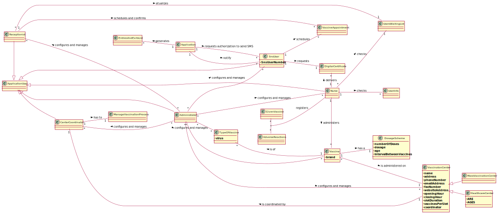

# OO Analysis #

The construction process of the domain model is based on the client specifications, especially the nouns (for _
concepts_) and verbs (for _relations_) used.

## Rationale to identify domain conceptual classes ##

To identify domain conceptual classes, start by making a list of candidate conceptual classes inspired by the list of
categories suggested in the book "Applying UML and Patterns: An Introduction to Object-Oriented Analysis and Design and
Iterative Development".

### _Conceptual Class Category List_ ###

**Business Transactions**

*

---

**Transaction Line Items**

*

---

**Product/Service related to a Transaction or Transaction Line Item**

* Vaccination
* Vaccination Centre Capacity

---

**Transaction Records**

*Confirm users data.

---  

**Roles of People or Organizations**

* Administrator, Nurse, Receptionist, User, Center Coordinator

---

**Places**

* Vaccination Centre
* Healthcare centres.

---

**Noteworthy Events**

*

---

**Physical Objects**

*

---

**Descriptions of Things**

*

---

**Catalogs**

*

---

**Containers**

*

---

**Elements of Containers**

*

---

**Organizations**

* SNS, DGS

---

**Other External/Collaborating Systems**

*

---

**Records of finance, work, contracts, legal matters**

*

---

**Financial Instruments**

*

---

**Documents mentioned/used to perform some work/**

* Reports, Vaccination History, Vaccination Certificate, Dosage Scheme

---

### **Rationale to identify associations between conceptual classes**###

An association is a relationship between instances of objects that indicates a relevant connection and that is worth of
remembering, or it is derivable from the List of Common Associations:

+ **_A_** is physically or logically part of **_B_**
+ **_A_** is physically or logically contained in/on **_B_**
+ **_A_** is a description for **_B_**
+ **_A_** known/logged/recorded/reported/captured in **_B_**
+ **_Administrator_** uses or manages or owns **_Vaccines_**
+ **_Administrator_** uses or manages or owns **_Vaccine Type_**
+ **_Administrator_** uses or manages or owns **_Vaccination Centre_**
+ **_Administrator_** uses or manages or owns **_Employees_**
+ **_Nurse_** checks or registers or records or issues **_List of SNS user´s_**
+ **_Nurse_** checks or registers or records or issues **_User´s info_**
+ **_Nurse_** checks or registers or records or issues **_User´s health condition_**
+ **_Nurse_** checks or registers or records or issues **_User´s scheduled vaccine type_**
+ **_Nurse_** checks or registers or records or issues **_User´s vaccination history_**
+ **_Nurse_** checks or registers or records or issues **_Vaccination type_**
+ **_Nurse_** checks or registers or records or issues **_Vaccine name/brand_**
+ **_Nurse_** checks or registers or records or issues **_Vaccine lot number_**
+ **_Nurse_** checks or registers or records or issues **_Vaccination certificate_**
+ **_Nurse_** checks or registers or records or issues **_Adverse reactions_**
+ **_Nurse_** checks or registers or records or issues **_System instructions regarding the vaccine_**
+ **_User_** schedules or obtains or authorizes **_Vaccine Apointment_**
+ **_User_** schedules or obtains or authorizes **_Vaccination Certificate_**
+ **_User_** schedules or obtains or authorizes **_DGS SMS message_**
+ **_Receptionist_** schedules or registers or confirms **_Vaccine for a User_**
+ **_Receptionist_** schedules or registers or confirms **_Arrival of a User_**
+ **_Receptionist_** schedules or registers or confirms **_Vaccine Scheduling_**
+ **_Centre Coordinator_** visualizes or generates or analyzes **_Vaccination charts and statistics_**
+ **_Centre Coordinator_** visualizes or generates or analyzes **_Reports_**
+ **_Centre Coordinator_** visualizes or generates or analyzes **_Data from other centres_**
+ **_A_** is related with a transaction (item) of **_B_**
+ etc.

| Concept (A)        | Association | Concept (B)                               |
|--------------------|:-----------:|:------------------------------------------|
| C1                 |    verb1    | C2                                        |
| Administrator      |   manages   | Vaccines                                  |
| Administrator      |   manages   | Vaccine Type                              |
| Administrator      |   manages   | Vaccination Centre                        |
| Administrator      |   manages   | Employees                                 |
| Nurse              |   checks    | List of SNS user´s                        |
| Nurse              |   checks    | User´s info                               |
| Nurse              |   checks    | User´s health condition                   |
| Nurse              |   checks    | User´s scheduled vaccine type             |
| Nurse              |   checks    | User´s vaccination history                |
| Nurse              |  registers  | Vaccination type                          |
| Nurse              |  registers  | Vaccine name/brand                        |
| Nurse              |   issues    | Vaccination certificate                   |
| Nurse              |  registers  | Vaccine lot number                        |
| Nurse              |  registers  | Adverse reactions                         |
| Nurse              |    gets     | System instructions regarding the vaccine |
| User               |  schedules  | Vaccine Apoitment                         |
| User               |   obtains   | Vaccination Certificate                   |
| Receptionist       |  schedules  | Vaccine for user                          |
| Receptionist       |  registers  | Arrival of a User                         |
| Receptionist       |  confirms   | Vaccine Scheduling                        |
| Centre Coordinator | visualizes  | Vaccination charts and statistics         |
| Centre Coordinator |  generates  | Reports                                   |
| Centre Coordinator |  analyzes   | Data from other centres                   |

## Domain Model

