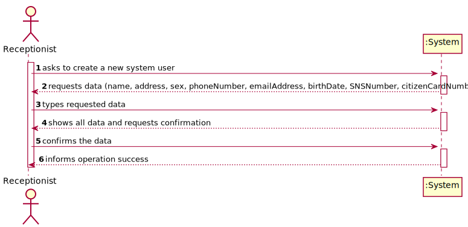
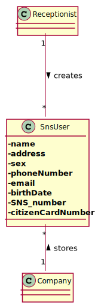
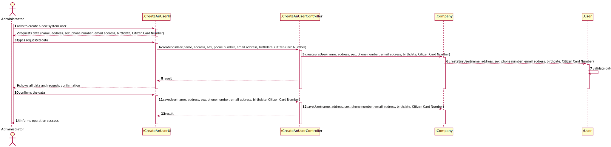
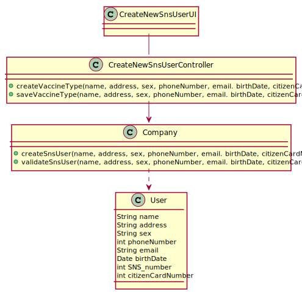

# US 03 - To register a SNS user

## 1. Requirements Engineering

### 1.1. User Story Description

As a receptionist, I want to register an SNS user.

### 1.2. Customer Specifications and Clarifications 

> **Question:** What are the specifications for the atributes?
>
> **Answer:** During Sprint B I will not introduce attribute rules/formats other than the ones that I already introduced (in this forum or in the project description).

> **Question:** Is the password supposed to be given or randomly generated?
>
> **Answer:** The password should be generated.

> **Question:** What are the atributes of a user?
>
> **Answer:** The attributes that should be used to describe a SNS user are: Name, Address, Sex, Phone Number, E-mail, Birth Date, SNS User Number and Citizen Card Number.
The Sex attribute is optional. All other fields are required.
The E-mail, Phone Number, Citizen Card Number and SNS User Number should be unique for each SNS user.

### 1.3. Acceptance Criteria

* **AC1:** The SNS user must become a system user.
* **AC1:** All required fields must be filled in.
* **AC3:** When creating a user with an already existing reference, the system must reject such operation and the user must have the change to modify the typed reference.

### 1.4. Found out Dependencies

* There is a dependency to "US010 Register a new Employee" since at least one receptinist must exist to register a new user.

### 1.5 Input and Output Data

**Input Data:**

* Typed data:
    * a name, 
    * a address, 
    * sex,
    * a phone number,
    * an email address,
    * a birthdate,
    * an SNS number,
    * a citizen card number
    

**Output Data:**

* (In)Success of the operation

### 1.6. System Sequence Diagram (SSD)

### 1.7 Other Relevant Remarks

No other relevant remarks.

## 2. OO Analysis

### 2.1. Relevant Domain Model Excerpt 

### 2.2. Other Remarks

Company also storages all the receptionists, but it is not relevent to be on this US domain model excerpt.

## 3. Design - User Story Realization 

### 3.1. Rationale

| Interaction ID | Which class responsible for...           | Answer               | Justification                                                                                                 |
|:---------------|:-----------------------------------------|:---------------------|:--------------------------------------------------------------------------------------------------------------|
| Step 1         | ...interacting with the actor?           | CreateUserUI         | Pure Fabrication: there is no reason to assign this responsibility to any existing class in the Domain Model. |
|                | ...coordinating the US                   | CreateUserController | **Controller**                                                                                                |
| Step 2         | ...instantiating a new User              | Company              | **Creator**                                                                                                   |
| Step 3         | ...saving the inputted data for the User | Company              | IE: An Administrator configures and manages the data                                                          |
| Step 4         | ...informing operation success           | CreateUserUI         | IE: is responsible for user interactions                                                                      |

 
### Systematization ##

According to the taken rationale, the conceptual classes promoted to software classes are: 

* None

Other software classes (i.e. Pure Fabrication) identified: 

 * CreateUserUI  
 * CreateUserController
 * CreateUserUI

## 3.2. Sequence Diagram (SD)

## 3.3. Class Diagram (CD)

