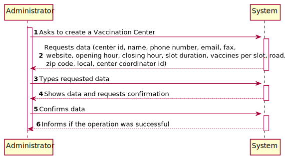
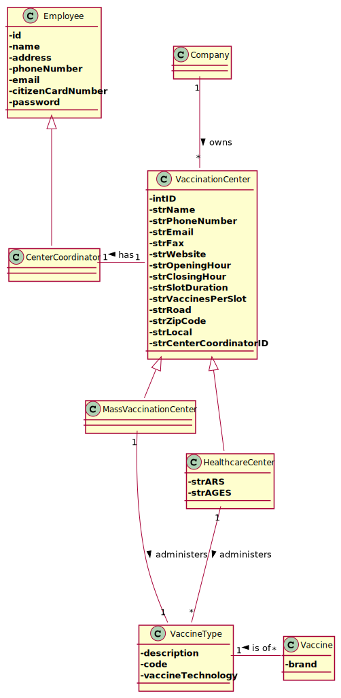
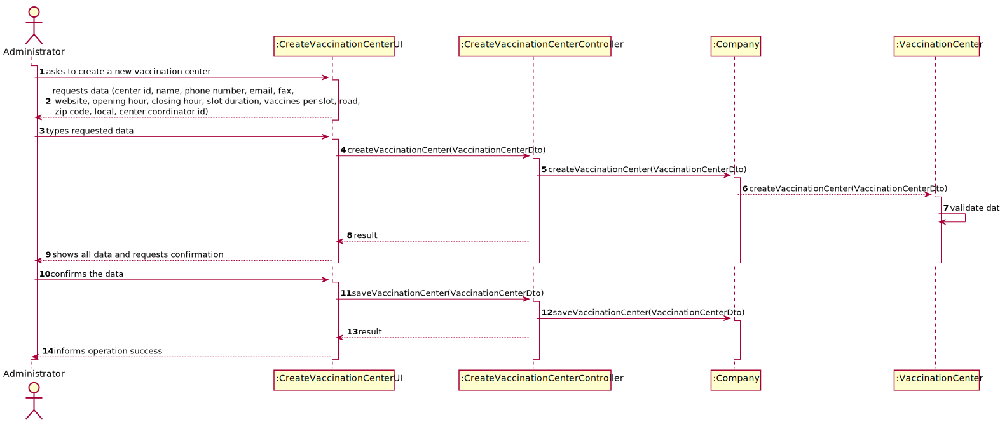
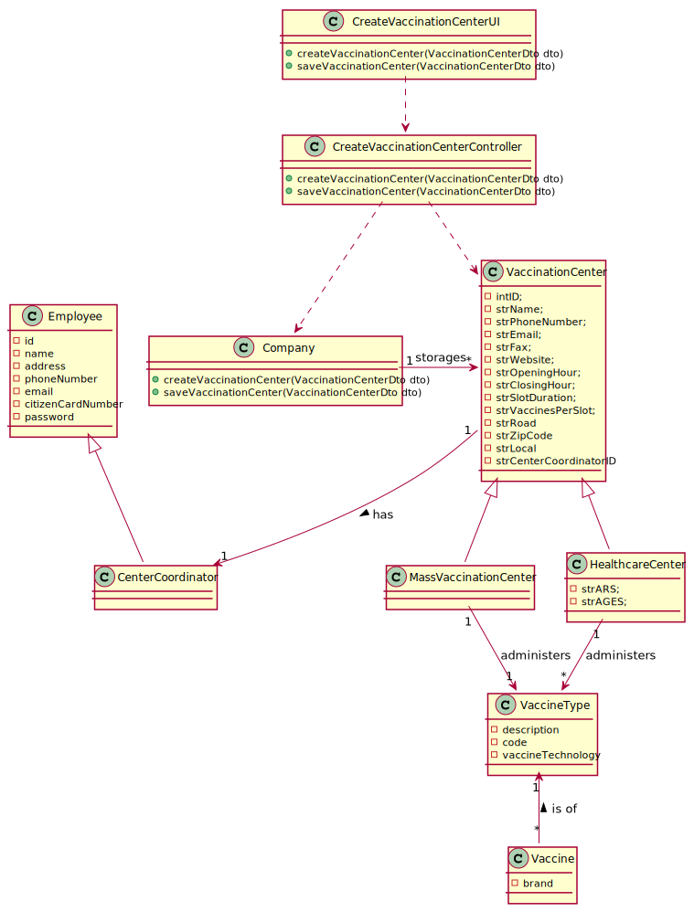

# US 009 - Register a Vaccination Center

## 1. Requirements Engineering

### 1.1. User Story Description

As an administrator, I want to register a vaccination center to respond to a certain pandemic.

### 1.2. Customer Specifications and Clarifications

**From the specifications document:**

> Different from the health care centers, which provide a wide range of healthcare services to citizens in  a certain area, the mass vaccination centers are facilities specifically created to aminister vaccines  of a single type as response to an ongoing disease outbreak (e.g.: Covid-19).

> The vaccination process flow and employees enrolled in the vaccination process are almost the same in each kind of vaccination center. The main difference between the two kinds of centers is that a healthcare center is associated with a given ars ( adminis tracao regional de saude ) and ages ( agrupamentos de centros de saude ), and it can administer any type of vaccines (e. G. : covid - 19, dengue, tetanus , smallpox ) . Moreover, nurses working in the healthcare centers can issue and deliver on site a vaccination certificate whenever a sns user asks for it . Both kinds of vaccination centers are characterized by a name, an address, a phone number, an e-mail address, a fax number, a website address, opening and closing hours, slot duration ( e. G. : 5 minutes) and the maximum number of vaccines that can be given per slot (e. G. : 10 vaccines per slot) . In addition, each vaccination center has one coordinator. Furthermore, receptionists and nurses registered in the application will work in the vaccination process. As the allocation of receptionists and nurses to vaccination centers might be complex, by now, the system might assume that receptionists and nurses can work on any vaccination center.

**From the client clarifications:**

> **Question:** How will be a center registered in the system (what data must be asked)?
>
> **Answer:** This information is available in the project description. When asking a question the student should show to be aware of all the information that the client has provided.

> **Answer:** Community mass vaccination centers are facilities created specifically to administer a single type of vaccine as a response to an ongoing disease outbreak. These centers are closed when there is no outbreak.

### 1.3. Acceptance Criteria

* **AC1:** All required fields must be filled in.

### 1.4. Found out Dependencies

* There is a dependency to "US010 As an administrator, I want to register a new employee" since every vaccination center has a Center Coordinator.

### 1.5 Input and Output Data

**Input Data:**

* Typed data:
    * id
    * name
    * phone number
    * email
    * fax
    * website
    * opening hour
    * closing hour
    * slot duration
    * vaccines per slot
    * road
    * zip code
    * local
    * center coordinator id

* Selected data:
    * N/A

**Output Data:**

* (In)Success of the operation

### 1.6. System Sequence Diagram (SSD)

### 1.7 Other Relevant Remarks

* No information in this field.

## 2. OO Analysis

### 2.1. Relevant Domain Model Excerpt

### 2.2. Other Remarks

n/a

## 3. Design - User Story Realization

### 3.1. Rationale

**SSD - Alternative 1 is adopted.**

| Interaction ID | Question: Which class is responsible for... | Answer  | Justification (with patterns)  |
|:-------------  |:--------------------- |:------------|:---------------------------- |
| Step 1  		 |	... interacting with the actor? | CreateVaccinationCenterUI   |  Pure Fabrication: there is no reason to assign this responsibility to any existing class in the Domain Model.           |
| 			  		 |	... coordinating the US? | CreateVaccinationCenterController | Controller                             |
| Step 2  		 |	...instantiating a new Vaccination Center						 | Company            |                              |
| Step 3  		 |	...saving the inputted data? | VaccinationCenter  | IE: object created in step 1 has its own data.  | 
| Step 4  		 |	... validating all data (local validation)? | VaccinationCenter | IE: owns its data.|
| Step 5  		 |	... informing operation success?| CreateVaccinationCenterUI  | IE: is responsible for user interactions.  | 

### Systematization ##

According to the taken rationale, the conceptual classes promoted to software classes are:

* Vaccination Center
* Company

Other software classes (i.e. Pure Fabrication) identified:

* CreateVaccinationCenterUI
* CreateVaccinationCenterController

## 3.2. Sequence Diagram (SD)

## 3.3. Class Diagram (CD)

