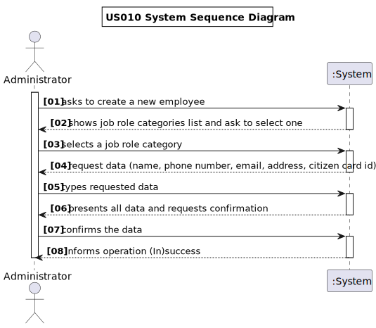

# US 010 - Register a new Employee.

## 1. Requirements Engineering

### 1.1. User Story Description

As an administrator, I want to register an employee.

### 1.2. Customer Specifications and Clarifications

**From the specifications document**

> Any DGS administrator uses the application to register centre coordinators, recepcionists and nurses enrolled in the
> vaccination process.

> All those who wish to use the application must be authenticated with a password holding seven alphanumeric characters,
> including three capital letters and two digits.

### 1.3. Acceptance Criteria

* **AC1:** Each user must have a single role defined in the system.
* **AC2:** The "auth" component available on the repository must be reused (without modifications).

### 1.4. Found out Dependencies

No dependecies were found, as this user storie does not depend on from any other US.

### 1.5 Input and Output Data

**Input Data**

* **Typed Data:**
**- Name,**
**- Job title,**
**- Email,**
**- Password,**
**- Address,**
**- Phone number,**
**- Citizen Card Number,**

* **Selected Data:**
**- Role,**

**Output Data**

* List of existing job titles,
* (In)Success of the operation,

### 1.6. System Sequence Diagram (SSD)

### 1.7 Other Relevant Remarks

**No information given was relevant to fulfill this field**

## 2. OO Analysis

### 2.1. Relevant Domain Model Excerpt

!**[US010-MD](US010_MD.svg)**

### 2.2. Other Remarks

**No additional remarks were found**

## 3. Design - User Story Realization

### 3.1. Rationale

**The rationale grounds on the SSD interactions and the identified input/output data.**

| Interaction ID | Question: Which class is responsible for...         | Answer                        | Justification (with patterns)                                                                                                         |
|:---------------|:----------------------------------------------------|:------------------------------|:--------------------------------------------------------------------------------------------------------------------------------------|
| Step 1         | ... interacting with the actor?                     | RegisterNewEmployeeUI         | Pure Fabrication: there is no reason to assign this responsibility to any existing class in the Domain Model.                         |
|                | ... coordinating the US?                            | RegisterNewEmployeeController | Controller                                                                                                                            |
| Step 2         | ...transfer the data typed in the UI to the domain? | RegisterNewEmployeeDto        | **DTO:** When there is so much data to transfer, it is better to opt by using a DTO in order to reduce coupling between UI and domain |
| Step 3         | ...knowing the job roles to show?                   | Constants                     | IE: Roles categories are defined by the Constants.                                                                                    |
| Step 4         | ... instantiating a new Employee                    | Company                       | **Creator**                                                                                                                           |
| Step 5         | 	...saving the inputted data?						                 | Company                       | IE: object created in step 1 has its own data.                                                                                        |
| Step 6         | 	...knowing the job roles to show?						            | Employee                      | IE: Task Categories are defined by the Employee.                                                                                      |
| Step 7         | ... saving the selected category?							            | RegisterNewEmployeeController | IE: object created in step 1 is classified in one Category.                                                                           |              
| Step 8         | ... validating all data (local validation)? 							 | Employee                      | IE: Employee has its own data.                                                                                                        |
| Step 9         | ... saving the created employee?	 						            | Company                       | IE: Employee owns all its data.                                                                                                       |
| Step 10        | ... informing operation success? 							            | RegisterNewEmployeeUI         | IE: is responsible for user interactions.                                                                                             |  

### Systematization ##

According to the taken rationale, the conceptual classes promoted to software classes are:

* **Center Coordinator**
* **Nurse**
* **Receptionist**
* **Company**

Other software classes (i.e. Pure Fabrication) identified:

* **RegisterNewEmployeeUI**
* **RegisterNewEmployeeController**

## 3.2. Sequence Diagram (SD)

*In this section, it is suggested to present an UML dynamic view stating the sequence of domain related software
objects' interactions that allows to fulfill the requirement.*

**[US010_SD](US010_SD.svg)**

## 3.3. Class Diagram (CD)

*In this section, it is suggested to present an UML static view representing the main domain related software classes
that are involved in fulfilling the requirement as well as and their relations, attributes and methods.*

**[US010_CD](US010_CD.svg)**