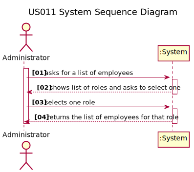
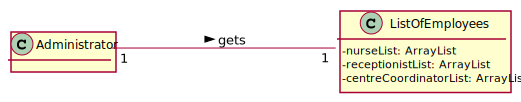
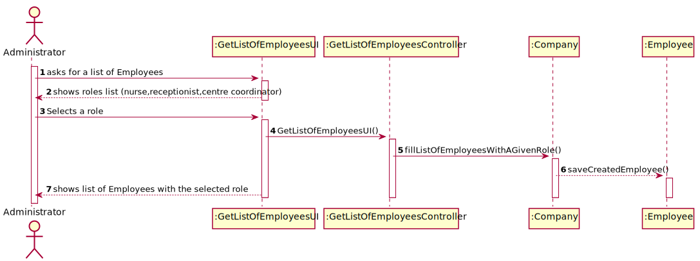
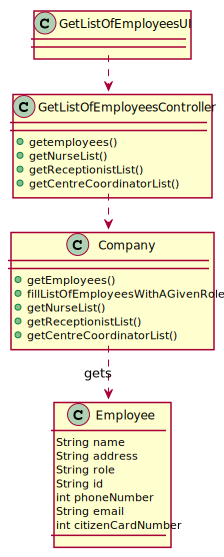

# US 011 - Get a list of Employees with a given function/role.

## 1. Requirements Engineering

### 1.1. User Story Description

> As an **Administrator**, I want to get a list of **Employees** with a given function/role.

### 1.2. Customer Specifications and Clarifications

**From the specifications document:**

> _No information about an administrator getting a list of Employees with a given role in the document._

**From the client clarifications:**

> **Question:** The list of employees to be got by the admin is per vaccination centre, isn't it?

> **Answer:** 

> **Question** Should the administrator type the role he wants to see the list or select it from a list of existing  roles?

> **Answer**

> **Question** Is there any requirement or input that the Administrator must insert to get the list of the employees?

> **Answer**

> **Question** What are the criteria that those employees need to meet to appear on that list?

> **Answer**

> **Question** Does the list of employees have any relevance on the functionality of the application?

> **Answer**

> **Question** Should we assume SNSUsers must also appear on that list?

> **Answer** The SNS user is not an Employee.

> **Question** Should we give the user the possibility of listing employees from more than 1 role?

> **Answer** The Administrator should select a given role and all employees associated with the selected role should be listed.

> **Question** Should the list be sorted in any specific way (for example alphabetical name order) or should we give the option to sort by other characteristics?

> **Answer** For now I just want to get a list of employees without considering the order of presentation.

> **Question** Should the list of employees concern a selected vaccination center or is it the list of every employee with a given function/role working for the company?
 
>  **Answer**
 
> **Question**  Besides the name of the employee, what other attributes do we need to show on the list? Can we show every single attribute, including password and username?
 
>  **Answer** The application should present all Employee attributes. Password is not an Employee attribute.

### 1.3. Acceptance Criteria

> _No acceptance criteria yet._

### 1.4. Found out Dependencies

> There is a dependency in the US010, "As an Administrator, I want to register a new employee", because in order to get a list of employees, it is necessary that the employees are previously registered.

### 1.5 Input and Output Data

**Input Data:**

> * List of Employees (option)
> * Role (option)

**Output Data:**

> * A list of options containing all the existing roles.
> * A list of employees with the selected role.

### 1.6. System Sequence Diagram (SSD)

### 1.7 Other Relevant Remarks

*To clarify the diagram, the administrator is given a list of options containing the different roles registered in the system, and selects the one he pretends to get the employee's list, and the system shows it.*

## 2. OO Analysis

### 2.1. Relevant Domain Model Excerpt

*In this section, it is suggested to present an excerpt of the domain model that is seen as relevant to fulfill this requirement.*

### 2.2. Other Remarks

> *_There aren't any other relevant remarks._*

## 3. Design - User Story Realization

### 3.1. Rationale

**The rationale grounds on the SSD interactions and the identified input/output data.**

| **_Interaction ID_** | **_Question: Which class is responsible for..._** | **_Answer_**  | **_Justification (with patterns)_**  |
|:-------------  |:--------------------- |:------------|:---------------------------- |
| Step 1  		 |	... interacting with the actor?	 |       GetListOfEmployeesUI      |    Pure Fabrication: there is no reason to assign this responsibility to any existing class in the Domain Model. | Step 2  		 |							 |             |                              |
| |... coordinating the US? | GetListOfEmployeesController| **Controller** |
| Step 2  		 |		... requesting the list of employees					 |   Company          |      **Creator**         |
| Step 3  		 |		... presenting the results  |  GetListOfEmployeesUI           |         IE: is responsible for user interactions.           |

### Systematization ##

According to the taken rationale, the conceptual classes promoted to software classes are:

> * Company

Other software classes (i.e. Pure Fabrication) identified:
> * GetListOfEmployeesUI
> * GetListOfEmployeesController

## 3.2. Sequence Diagram (SD)

*In this section, it is suggested to present an UML dynamic view stating the sequence of domain related software objects' interactions that allows to fulfill the requirement.*

## 3.3. Class Diagram (CD)

*In this section, it is suggested to present an UML static view representing the main domain related software classes that are involved in fulfilling the requirement as well as and their relations, attributes and methods.*

