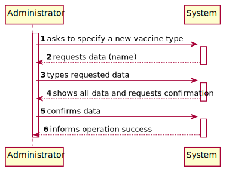
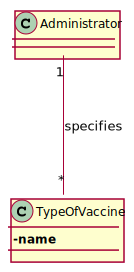
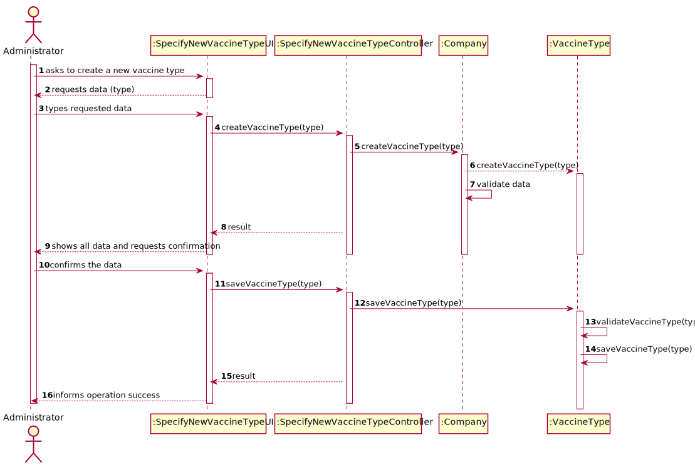
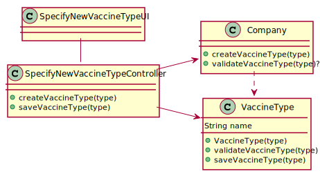

# US 006 - To create a Task 

## 1. Requirements Engineering

### 1.1. User Story Description

As an administrator, I intend to specify a new vaccine type 

### 1.2. Customer Specifications and Clarifications 

**From the specifications document:**

> Each vaccine type is characterized by the name of the virus.

**From the client clarifications:**

> **Question:** What varies between vaccines types? 
>  
> **Answer:** Vaccine dosage, number of doses and time between them.

-

> **Question:** What defines those attributes?
>  
> **Answer:** Those are defined per age group. Each age group has different combinations.

### 1.3. Acceptance Criteria

* **AC1:** All required fiels must be filled in.
* **AC2:** Task reference must have at least 5 alphanumeric chars.
* **AC3:** When creating a task with an already existing reference, the system must reject such operation and the user must have the change to modify the typed reference.

**No information was given in this field.**

### 1.4. Found out Dependencies

* There is a dependency to "US013 Specify a new vaccine" since every vaccine has a type.

### 1.5 Input and Output Data
 
**Input**
+ name

**Output**
+ (In)success of the operation

### 1.6. System Sequence Diagram (SSD)

### 1.7 Other Relevant Remarks

**No information was given in this field**

## 2. OO Analysis

### 2.1. Relevant Domain Model Excerpt 

### 2.2. Other Remarks

n/a

## 3. Design - User Story Realization 

### 3.1. Rationale

**SSD - Alternative 1 is adopted.**

| Interaction ID | Question: Which class is responsible for...             | Answer                | Justification (with patterns)  |
|:-------------  |:--------------------------------------------------------|:----------------------|:---------------------------- |
| Step 1  		 |	... interacting with the actor?                        | CreateTaskUI          |  Pure Fabrication: there is no reason to assign this responsibility to any existing class in the Domain Model.           |
| 				 |	... coordinating the US?                               | CreateTaskController  | Controller                             |
| 				 |	... instantiating a new Task?                          | Organization          | Creator (Rule 1): in the DM Organization has a Task.   |
| 				 |  ... knowing the user using the system?                 | UserSession           | IE: cf. A&A component documentation.  |
| 				 |	... knowing to which organization the user belongs to? | Platform              | IE: has registed all Organizations |
| 				 |							                               | Organization          | IE: knows/has its own Employees|
| 			  	 |							                               | Employee              | IE: knows its own data (e.g. email) |
| Step 2  		 |							                               |                       |                              |
| Step 3  		 |	...saving the inputted data?                           | Task                  | IE: object created in step 1 has its own data.  |
| Step 4  		 |	...knowing the task categories to show?                | Platform              | IE: Task Categories are defined by the Platform. |
| Step 5  		 |	... saving the selected category?                      | Task                  | IE: object created in step 1 is classified in one Category.  |
| Step 6  		 |							                               |                       |                              |              
| Step 7  		 |	... validating all data (local validation)?            | Task                  | IE: owns its data.| 
| 			  	 |	... validating all data (global validation)?           | Organization          | IE: knows all its tasks.| 
| 			  	 |	... saving the created task?                           | Organization          | IE: owns all its tasks.| 
| Step 8  		 |	... informing operation success?                       | CreateTaskUI          | IE: is responsible for user interactions.  | 

### Systematization ##

According to the taken rationale, the conceptual classes promoted to software classes are: 

 * Organization
 * Platform
 * Task

Other software classes (i.e. Pure Fabrication) identified: 

 * CreateTaskUI  
 * CreateTaskController

## 3.2. Sequence Diagram (SD)

## 3.3. Class Diagram (CD)

**From alternative 1**

