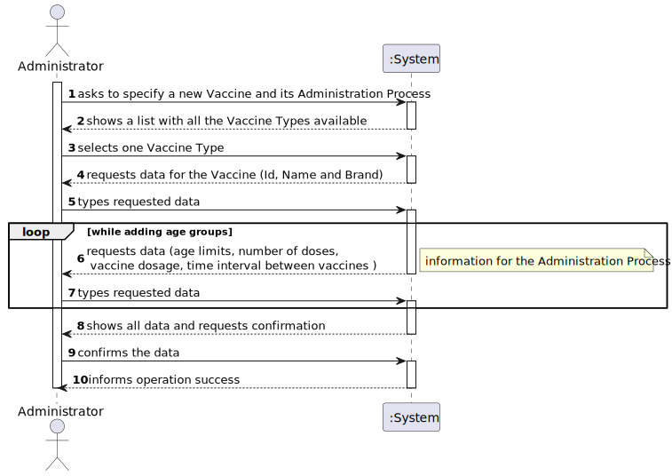
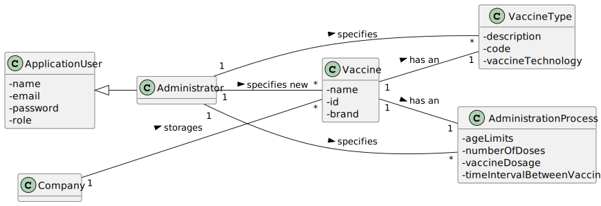
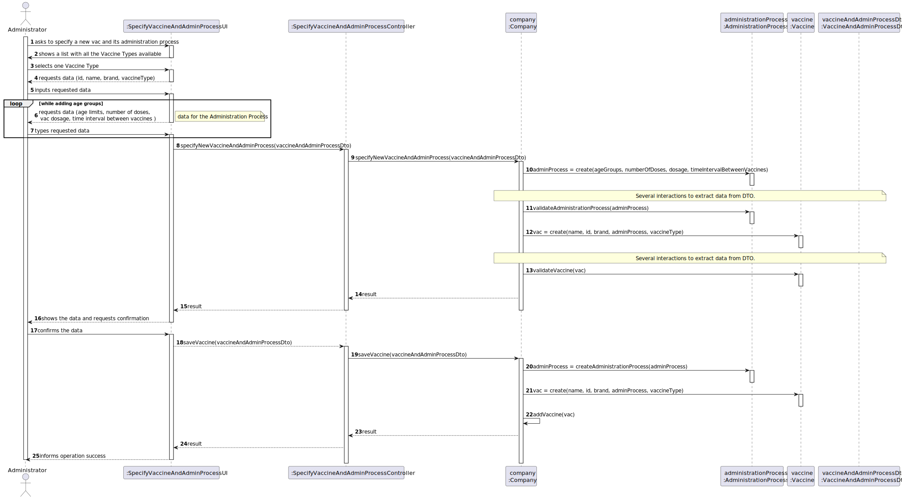
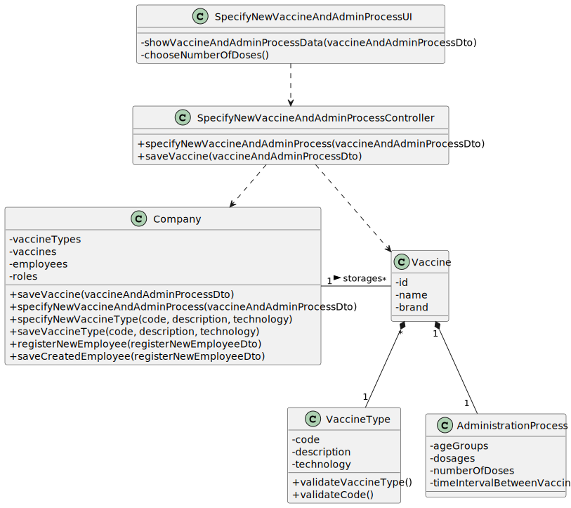

# US 013 - Specify a new vaccine and its administration process

## 1. Requirements Engineering

### 1.1. User Story Description

As an **administrator**, I want to register a **new vaccine and its administration process**.

### 1.2. Customer Specifications and Clarifications 

**From the specifications document:**

> [...] it is worth noticing that for each type of vaccine, several vaccines might exist, each one demanding a distinct administration process.

> The vaccine administration process comprises (i) one or more age groups (e.g.: 5 to 12 years old, 13 to 18 years old, greater than 18 years old), and (ii) per age group, the doses to be administered (e.g.: 1, 2, 3), the vaccine dosage (e.g.: 30 ml), and the time interval regarding the previously administered dose. Regarding this, it is important to notice that between doses (e.g.: between the 1st and 2nd doses) the dosage to be administered might vary as well as the time interval elapsing between two consecutive doses (e.g.: between the 1st and 2nd doses 21 days might be required, while between the 2nd and the 3rd doses 6 months might be required).

**From the client clarifications:**

> **Question:** Which attributes does the Vaccine have (besides the ones refering to the Vaccine Type)?
>
> **Answer:** Each vaccine has the following attributes: Id, Name, Brand, Vaccine Type, Age Group, Dose Number, Vaccine Dosage and Time Since Last Dose.

> **Question:** We would like to know if when specifying a new Vaccine and its Administration Process, should a list of the existing types of vaccines be displayed in order for him to choose one, or should he just input it?
>
> **Answer:** If the information is available in the system, it is a good practice to present the information to the user and ask the user to select.

> **Question:** As to the interval between doses, what time format are we to use? (e.g. days, weeks, months)
>
> **Answer:** Number of days.

### 1.3. Acceptance Criteria

* **AC1:** The new vaccine can't have the same Id as a previously created vaccine.
* **AC2:** All required data must be filled.
* **AC3:** The age limits for the age groups should be coherent.

### 1.4. Found out Dependencies

There is a dependency related to the US012, since a Vaccine has as one of its attributes the Vaccine Type. In order to
specify a new vaccine, it's required that there is at least one Vaccine Type already. 

### 1.5 Input and Output Data

**Input Data:**
* Typed data:
  - Id;
  - Brand;
  - Vaccine Name;
  - Age limits for each age group;
  - Number of doses, per age group;
  - Vaccine dosage ( e.g.: 30 ml);
  - Time interval between vaccines, considering the dose number given previously;

* Selected data:
    - Vaccine Type;

**Output Data:**

* A list with all the Vaccine Types available
* (In)Success of the operation

### 1.6. System Sequence Diagram (SSD)

### 1.7 Other Relevant Remarks

To clarify this client response: "A vaccine has the following attributes: ID, Name, Brand, Vaccine Type, Age Group, Dose
Number, Vaccine Dosage and Time Since Last Dose". Each vaccine has those attributes, but when specifying a new vaccine (
which is different from the Nurse related US of registering a vaccine), there should also be another attribute, the
Administration Process.  
There's also the possibility that there will be a "GivenVaccine" class that would have those attributes, since those are
related to a vaccine that was given and not to an actual Vaccine like the project description describes:
"For instance, for the Covid-19 type, there is (i) the Pfizer vaccine, (ii) the Moderna vaccine, (iii) the AstraZeneca
vaccine, and so on"

Summarizing, there should be Vaccine Types (Covid-19, Flu, etc...)/(Even to the same disease but using different technologies), to those types there should be different Vaccines (
Pfizer, Moderna, etc...), and then there should be a Given Vaccine class, where there is all the information about a
vaccine that was given:
ID, Name, Brand, Vaccine Type, Age Group, Dose Number, Vaccine Dosage and Time Since Last Dose.

## 2. OO Analysis

### 2.1. Relevant Domain Model Excerpt

### 2.2. Other Remarks

No other relevant remarks.

## 3. Design - User Story Realization 

### 3.1. Rationale

**The rationale grounds on the SSD interactions and the identified input/output data.**

| Interaction ID | Question: Which class is responsible for... | Answer  | Justification (with patterns)  |
|:-------------  |:--------------------- |:------------|:---------------------------- |
| Step 1         |    ... interacting with the actor? | SpecifyVaccineAndAdminProcessUI   |  Pure Fabrication: there is no reason to assign this responsibility to any existing class in the Domain Model.   |
| 			  		 |    ... coordinating the US? | SpecifyVaccineAndAdminProcessController | **Controller**  |
| Step 2  |    ...transfer the data typed in the UI to the domain? | VaccineAndAdminProcessDto | **DTO:** When there is so much data to transfer, it is better to opt by using a DTO in order to reduce coupling between UI and domain |
| Step 3     |    ... instantiating a new Vaccine  | Company | By applying the **Creator** pattern, the "Company" is responsible for instantiating a new "Vaccine", since it is the one who storages the Vaccines.   |
| 	 |    ... instantiating a new Administration Process | Vaccine |By applying the **Creator** pattern, the "Vaccine" is responsible for instantiating the "Administration Process", since a "Vaccine" has/contains an Administration Process|
| Step 4         |    ...validating the inputted data for the Vaccine | Vaccine | The Vaccine class should know what needs to be validated in order to actually create a "Vaccine"|
| 		 |    ...validating the inputted data for the Administration Process | Administration Process |The Administration Process class should know what needs to be validated in order to actually create an "Administration Process"  |
| Step 5         |    ...saving the inputted data for the Vaccine ? | Vaccine | **IE:** A Vaccine has its own data |
|   		 |    ...saving the inputted data for the Administration Process? | AdministrationProcess  | **IE:** An Administration Process has its own data |
| Step 7  |    ... informing operation success | SpecifyVaccineAndAdminProcessUI  | **IE:** is responsible for user interactions  | 

### Systematization ##

According to the taken rationale, the conceptual classes promoted to software classes are: 

* VaccineAndAdminProcessDto
* Vaccine
* AdministrationProcess
* Company (already implemented)

Other software classes (i.e. Pure Fabrication) identified: 
* SpecifyVaccineAndAdminProcessUI
* SpecifyVaccineAndAdminProcessController

## 3.2. Sequence Diagram (SD)

## 3.3. Class Diagram (CD)

*In this section, it is suggested to present an UML static view representing the main domain related software classes that are involved in fulfilling the requirement as well as and their relations, attributes and methods.*

