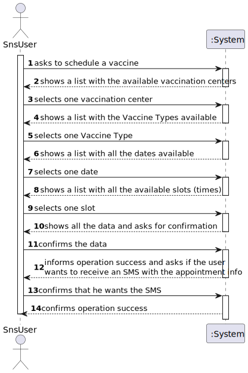
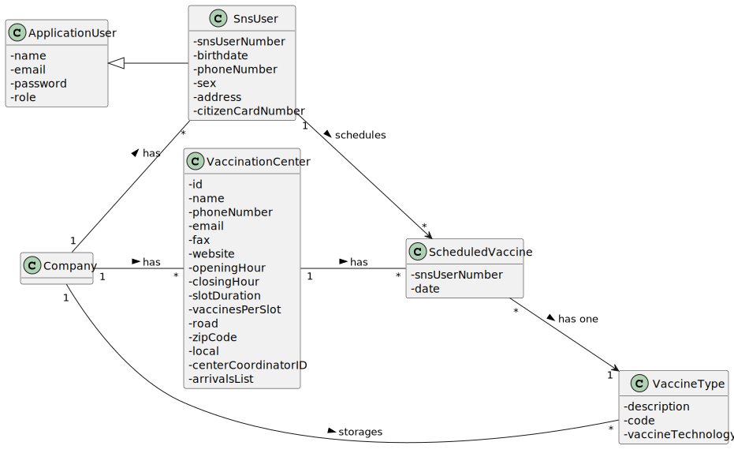
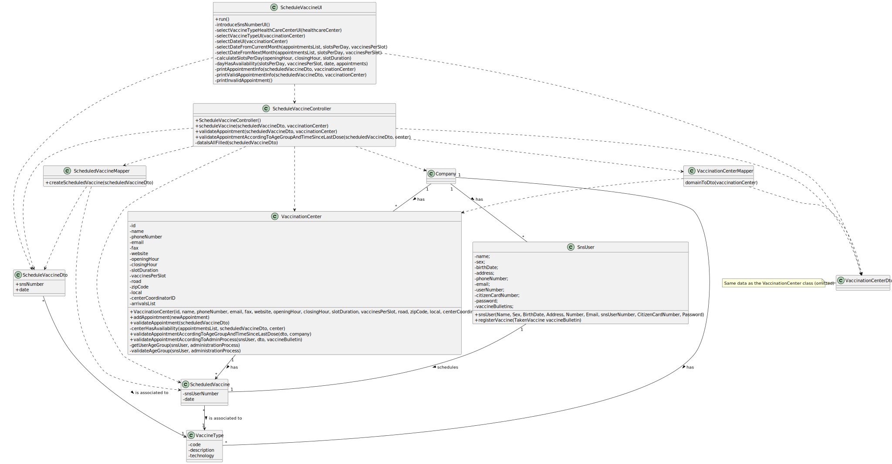

# US 001 - Schedule a Vaccine

## 1. Requirements Engineering

### 1.1. User Story Description

As an **SNS User**, I intend to use the application to **schedule a vaccine**.

### 1.2. Customer Specifications and Clarifications 

**From the specifications document:**

> To take a vaccine, the SNS user should use the application to schedule his/her vaccination.
> 
>The user
should introduce his/her SNS user number, select the vaccination center, the date, and the time (s)he
wants to be vaccinated as well as the type of vaccine to be administered (by default, the system
suggests the one related to the ongoing outbreak). 
>
> Then, the application should check the
vaccination center capacity for that day/time and, if possible, confirm that the vaccination is
scheduled and inform the user that (s)he should be at the selected vaccination center at the
scheduled day and time.
>
> The SNS user may also authorize the DGS to send an SMS message with
information about the scheduled appointment. If the user authorizes the sending of the SMS, the
application should send an SMS message when the vaccination event is scheduled and registered in
the system.

**From the client clarifications:**

> **Question:** "What kind of information should be included in an SMS Message to warn of a scheduling? (for example, the SNS number, center, day, time and vaccine type)?"
>
> **Answer:** Date, Time and vaccination center.

> **Question:** "...The SNS user may also authorize the DGS to send an SMS message with information about the scheduled appointment..."
>
>Which interpretation is correct?: The user should and will authorize or the user can do so if he wants. Because if he doesn't authorize how will he receive the information?
>
> 
>
> **Answer:** The SNS user should give authorization to DGS so that DGS can send him an SMS.
>
>When scheduling a vaccination event, the SNS user should always see all the information about the scheduled appointment.

> **Question:** "We are unsure if it's in this user stories that's asked to implement the "send an SMS message with information about the scheduled appointment" found on the Project Description available in moodle. Could you clarify?"
>
> **Answer:** In a previous clarification that I made on this forum, I said: "[The user should receive a] SMS Message to warn of a scheduling [and the message] should include: Date, Time and vaccination center". Teams must record the answers!
>A file named SMS.txt should be used to receive/record the SMS messages. We will not use a real word service to send SMSs.

> **Question:** "For the US1, the acceptance criteria is: A SNS user cannot schedule the same vaccine more than once. For the US2, the acceptance criteria is: The algorithm should check if the SNS User is within the age and time since the last vaccine.
[1] Are this acceptance criteria exclusive of each US or are implemented in both?
[2] To make the development of each US more clear, could you clarify the differences between the two US?"
>
> **Answer:** 1- The acceptance criteria for US1 and US2 should be merged. The acceptance criteria por US1 and US2 is: A SNS user cannot schedule the same vaccine more than once. The algorithm should check if the SNS User is within the age and time since the last vaccine.
>
> 2- In US1 the actor is the SNS user, in US2 the actor is the receptionist. In US1 the SNS user is already logged in the system and information that is required and that exists in the system should be automatically obtained. In US2 the receptionist should ask the SNS user for the information needed to schedule a vaccination. Information describing the SNS user should be automatically obtained by introducing the SNS user number.

>**Client clarification:** The acceptance criteria for US1 and US2 are: a. An SNS user cannot schedule the same vaccine more than once. b. The algorithm should check if the SNS User is within the age and time since the last vaccine.
>
>This means:
>
>a. At a given moment, the SNS user cannot have more than one vaccine (of a given type) scheduled;
> 
>b. The algorithm has to check which vaccine the SNS user took before and check if the conditions (age and time since the last vaccine) are met. If the conditions are met the vaccination event should be scheduled and registered in the system. When scheduling the first dose there is no need to check these conditions.

>**Client clarification:** In a previous message I said: "The acceptance criteria for US1 and US2 are: a. An SNS user cannot schedule the same vaccine more than once. b. The algorithm should check if the SNS User is within the age and time since the last vaccine".
>
>We can always prepare a system for these two acceptance criteria. Even so, as we are in the final stage of Sprint C, we will drop the acceptance criteria b ( The algorithm should check if the SNS User is within the age and time since the last vaccine). This acceptance criteria will be included in Sprint D.

>**Question:** "The project description says "To take a vaccine, the SNS user should use the application to schedule his/her vaccination. The user should introduce his/her SNS user number, select the vaccination center, the date, and the time(s)he wants to be vaccinated as well as the type of vaccine to be administered [...]".
Does the user have to enter the date and time they want or does the system have to show the available dates and times for the user to select?"
>
>**Answer:** In this sprint the actor should introduce (using the keyboard) the date and time (s)he wants to be vaccinated.

### 1.3. Acceptance Criteria

* **AC1:** A SNS user cannot schedule the same vaccine more than
  once.
* **AC2:** All required data must be filled.
* **AC3:** The vaccination center has to have availability.
* **AC4:** The SNS User must be is within the age of the Vaccine.
* **AC5:** Time since the last dose for that Vaccine has to be completed.

Note: Accounting to one of the client clarifications AC4 and AC5 just need to be implemented in Sprint D.

### 1.4. Found out Dependencies

There is a dependency related to the US003 and US014, since for an SNS User to schedule a vaccine there's the need of having him registered in the System.
There is a dependency to the US009 and US013, since in order to schedule a vaccine it is required that the System has Vaccination Centers and Vaccines, respectively.

### 1.5 Input and Output Data

**Input Data:**
* Typed data:
  - SNS Number

* Selected data:
    - Vaccination Center;
    - Vaccine Type;
    - Date;
    - Time;
    

**Output Data:**

* A list with all the Vaccination Centers available
* A list with all the Vaccine Types available
* A list with dates
* A list with times
* (In)Success of the operation

### 1.6. System Sequence Diagram (SSD)

### 1.7 Other Relevant Remarks

During the Sprint C all the necessary functions were developed successfully in order to fulfill the Client requirements.
Since in the final days of the Sprint, some teams weren't able to fully comprehend what was asked in this user story and only understood it after a late Client clarification, he postponed both AC4 and AC5 to Sprint D. 
Since it will still be required in Sprint D, the team chose to leave it fully completed.

## 2. OO Analysis

### 2.1. Relevant Domain Model Excerpt

### 2.2. Other Remarks

No other relevant remarks.

## 3. Design - User Story Realization 

### 3.1. Rationale

| Interaction ID | Question: Which class is responsible for... | Answer  | Justification (with patterns)  |
|:-------------  |:--------------------- |:------------|:---------------------------- |
| Step 1         |    ... showing the list with all the Vaccination Centers available | ScheduleVaccineUI   |  **Pure Fabrication:** there is no reason to assign this responsibility to any existing class in the Domain Model.   |
| 			  		 |    ... disponibilize the previous list to the ScheduleVaccineUI  | ScheduleVaccineController | **Controller:** act as a mediator between the UI and the Model. Has the responsibility of controlling the data transmission between both. It maps the user action into model updates.  |
| 			  		 |    ... disponibilize the previous list to the ScheduleVaccineController  | Company | **IE:** The Company knows all of it's Vaccination Centers.  |
| | ...saving the selected Vaccination Center | ScheduleVaccineController | **IE:** the controller needs to know the selected Vaccination Center throughout the whole process of scheduling a Vaccine |
| Step 2         |    ... showing the list with all the Vaccine Types available for the selected Vaccination Center | ScheduleVaccineUI   |  **Pure Fabrication:** there is no reason to assign this responsibility to any existing class in the Domain Model.   |
| 			  		 |    ... disponibilize the previous list to the ScheduleVaccineUI  | ScheduleVaccineController | **Controller:** act as a mediator between the UI and the Model. Has the responsibility of controlling the data transmission between both. It maps the user action into model updates.  |
| 			  		 |    ... disponibilize the previous list to the ScheduleVaccineController  | VaccinationCenter | **IE:** The Vaccination Center knows all of it's Vaccine Types.  |
| | ...saving the selected Vaccine Type | ScheduleVaccineDto | **IE:** In order to schedule a Vaccine there are required: a Vaccine Type, a Date and an SNS number, therefore those have to be temporarily stored, so that in moment of instantiating an appointment all the information is together |
| Step 3         |    ... showing the list with all the available dates to schedule Vaccine | ScheduleVaccineUI   |  **Pure Fabrication:** there is no reason to assign this responsibility to any existing class in the Domain Model.   |
| 			  		 |    ... disponibilize the previous list to the ScheduleVaccineUI  | ScheduleVaccineController | **Controller:** act as a mediator between the UI and the Model. Has the responsibility of controlling the data transmission between both. It maps the user action into model updates.  |
| 			  		 |    ... disponibilize the appointments to the controller | VaccinationCenter | **IE:** The Vaccination Center knows all of it's Scheduled Vaccines.  |
| | ...saving the selected date | ScheduleVaccineDto | **IE:** In order to schedule a Vaccine there are required: a Vaccine Type, a Date and an SNS number, therefore those have to be temporarily stored, so that in moment of instantiating an appointment all the information is together   |
| Step 4         |    ... showing the list with all the available slots to schedule Vaccine | ScheduleVaccineUI   |  **Pure Fabrication:** there is no reason to assign this responsibility to any existing class in the Domain Model.   |
| 			  		 |    ... disponibilize the previous list to the ScheduleVaccineUI  | ScheduleVaccineController | **Controller:** act as a mediator between the UI and the Model. Has the responsibility of controlling the data transmission between both. It maps the user action into model updates.  |
| 			  		 |    ... disponibilize the appointments to the controller | VaccinationCenter | **IE:** The Vaccination Center knows all of it's Scheduled Vaccines.  |
| | ...saving the selected date | ScheduleVaccineDto | **IE:** In order to schedule a Vaccine there are required: a Vaccine Type, a Date and an SNS number, therefore those have to be temporarily stored, so that in moment of instantiating an appointment all the information is together   |
| Step 5 |    ...transfer the selected typed in the UI to the domain? | ScheduleVaccineDto | **DTO:** When there is so much data to transfer, it is better to opt by using a DTO in order to reduce coupling between UI and domain |
| Step 6  |    ... validating an an appointment | ScheduleVaccineController | **Controller:** act as a mediator between the UI and the Model. Has the responsibility of controlling the data transmission between both. It maps the user action into model updates. |
|   |    ... validating if the user is eligible for the Vaccine | Company |  **IE:** The Company knows all the appointments, therefore it can check if a User already has an appointment for the same Vaccine Type |
|   |    ... validating the selected data for the appointment | VaccinationCenter  |  **IE:** The Vaccination Center knows it's appointments, it's Vaccines and Administration processes, therefore it can check if the validity of an appointment |
|    |    ... knowing the time interval between doses for a given age group and knowing the age groups  | AdministrationProcess |  **IE:** The Sns User knows it's taken vaccines and all the personal information about a User, therefore when was the last dose of one and the age. |
|    |    ... knowing the Administration Processes for a Vaccine  | Vaccine |  **IE:** The Vaccine knows it's Administration Processes |
|    |    ... knowing the time since the user's last Vaccine and user's age  | SnsUser |  **IE:** The Sns User knows it's taken vaccines and all the personal information about a User, therefore when was the last dose of one and the age. |
| Step 7   |    ... showing all the data to be confirmed | ScheduleVaccineUI   |  **Pure Fabrication:** there is no reason to assign this responsibility to any existing class in the Domain Model.   |
| Step 8   |    ... schedule a Vaccine | ScheduleVaccineController | **Controller:** act as a mediator between the UI and the Model. Has the responsibility of controlling the data transmission between both. It maps the user action into model updates.   |
|    |    ... instantiating a Scheduled Vaccine?  | ScheduleVaccineMapper | By applying the **Creator** pattern, the "ScheduleVaccineMapper" is responsible for instantiating a new "ScheduledVaccine", since it is the one who   |
|          |    ...saving the Appointment? | AppointmentsList | **IE:** A list with all the appointments.  |
| Step 9   |    ... informing the operation success and showing the appointment info | ScheduleVaccineUI | **Pure Fabrication:** there is no reason to assign this responsibility to any existing class in the Domain Model.   |
| Step 10   |    ... asking the User if he wants to receive an SMS with the appointment info | ScheduleVaccineUI | **Pure Fabrication:** there is no reason to assign this responsibility to any existing class in the Domain Model.   |
| Step 11   |    ... printing the SMS information to a file | ScheduleVaccineController |  **Controller:** act as a mediator between the UI and the Model. Has the responsibility of controlling the data transmission between both. It maps the user action into model updates.   |
| Step 12   |    ... informing the operation success | ScheduleVaccineUI | **Pure Fabrication:** there is no reason to assign this responsibility to any existing class in the Domain Model.   |

### Systematization ##

According to the taken rationale, the conceptual classes promoted to software classes are: 

* ScheduledVaccine
* VaccinationCenter

Other software classes (i.e. Pure Fabrication) identified:
* ScheduleVaccineUI
* ScheduleVaccineController
* ScheduledVaccineDto
* ScheduledVaccineMapper
* SnsUser 
* Vaccine 
* Administration Process 
* Company

## 3.2. Sequence Diagram (SD)

## 3.3. Class Diagram (CD)

