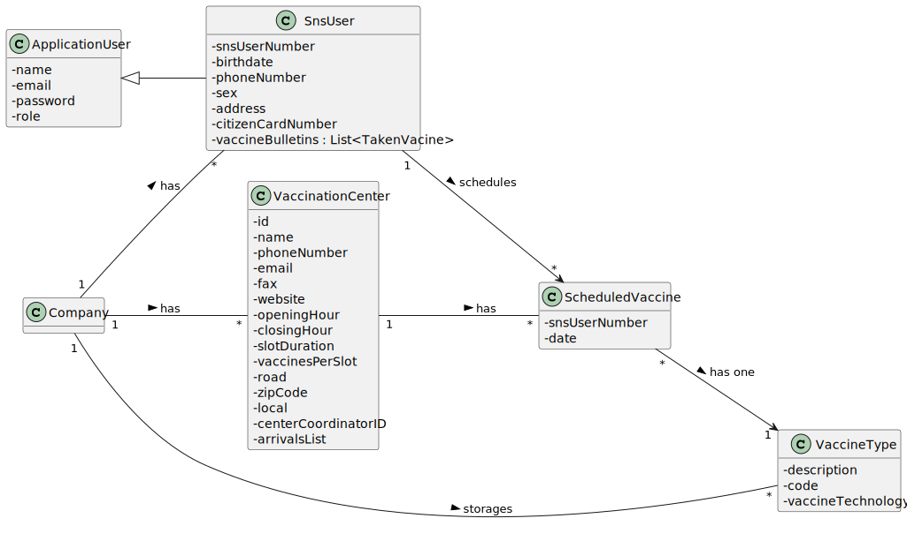
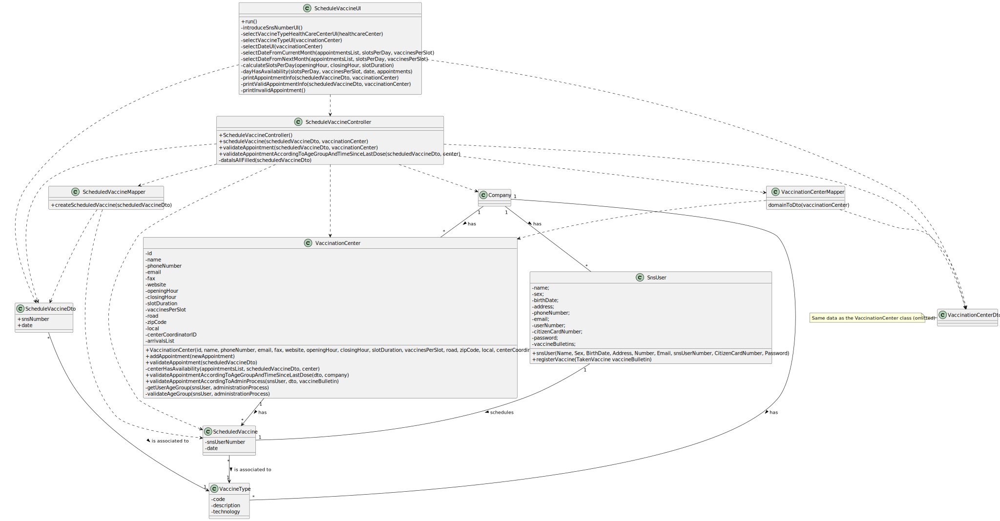

# US 002 - Schedule Vaccination

## 1. Requirements Engineering

### 1.1. User Story Description

As a **receptionist**, I want to schedule a **vaccination**.

### 1.2. Customer Specifications and Clarifications

**From the specifications document:**

> Moreover, receptionists working in the healthcare centers can issue and deliver on site a vaccination certificate whenever an SNS user asks for it.

> The user should select [...] the type of vaccine to be administered (by default, the system suggests the one related to the ongoing outbreak).

> Then, the application should check the vaccination center capacity for that day/time and, if possible, confirm that the vaccination is
scheduled and inform the user that (s)he should be at the selected vaccination center at the scheduled day and time.

**From the client clarifications:**

> **Question:** Receptionists have the ability to schedule an appointment in different vaccination centres or only on their own?
>
> **Answer** The receptionist has the ability to schedule the vaccine in any vaccination center. The receptionist should ask the SNS user to indicate/select the preferred vaccination center.

> **Question:** How should we verify that a vaccination center is already registered in the system? Which attribute should the system use to verify this (ex. name, phone number)?
>
> **Answer** To schedule a vaccination, a user (US1) or a receptionist (US2) should select a vaccination center from a list.

> **Question:** When a receptionist schedules a vaccination for an SNS user, should they be presented with a list of available vaccines (brands, that meet acceptance criteria) from which to choose?
Or should the application suggest only one?
>
> **Answer** The receptionist do not select the vaccine brand. When the user is at the vaccination center to take the vaccine, the nurse selects the vaccine. 
In Sprint D we will introduce new USs where the nurse records the administration of a vaccine to a SNS user.

> **Question:** We are unsure if it's in this user stories that's asked to implement the "send a SMS message with information about the scheduled appointment" found on the Project Description available in moodle. Could you clarify?
>
> **Answer** [...] A file named SMS.txt should be used to receive/record the SMS messages. We will not use a real word service to send SMSs.

> **Question:** "For the US1, the acceptance criteria is: A SNS user cannot schedule the same vaccine more than once. For the US2, the acceptance criteria is: The algorithm should check if the SNS User is within the age and time since the last vaccine.
[1] Are this acceptance criteria exclusive of each US or are implemented in both?
[2] To make the development of each US more clear, could you clarify the differences between the two US?"
>
> **Answer:** 1- The acceptance criteria for US1 and US2 should be merged. The acceptance criteria por US1 and US2 is: A SNS user cannot schedule the same vaccine more than once. The algorithm should check if the SNS User is within the age and time since the last vaccine.
>
> 2- In US1 the actor is the SNS user, in US2 the actor is the receptionist. In US1 the SNS user is already logged in the system and information that is required and that exists in the system should be automatically obtained. In US2 the receptionist should ask the SNS user for the information needed to schedule a vaccination. Information describing the SNS user should be automatically obtained by introducing the SNS user number.

> **Question** "The acceptance criteria for US1 and US2 are: a. An SNS user cannot schedule the same vaccine more than once. b. The algorithm should check if the SNS User is within the age and time since the last vaccine."
>
> **Answer**
> 
>a. At a given moment, the SNS user cannot have more than one vaccine (of a given type) scheduled;
>
>b. The algorithm has to check which vaccine the SNS user took before and check if the conditions (age and time since the last vaccine) are met. If the conditions are met the vaccination event should be scheduled and registered in the system. When scheduling the first dose there is no need to check these conditions.

### 1.3. Acceptance Criteria

* **AC1:** Check if the SNS User is within the age.
* **AC2:** Time since the last vaccine.
* **AC3:** All data must be filled.
* **AC4:** Vaccination Center availability.
* **AC5:** A SNS user cannot schedule the same vaccine more than once. (Added from one of the client´s clarifications).

### 1.4. Found out Dependencies

Exists a dependency related to US001, since to get the last time a User has taken a vaccine there must have been a
previous scheduling of a vaccine.
US002 is also dependent on the US013, as a matter effect the system must have registered vaccines in order to schedule a
vaccination.
There is also a dependency related to both US003 and US014, because to schedule vaccination there must be SNS Users.

### 1.5 Input and Output Data

**Input Data:**

* Typed data:
    - SNS Number;

* Selected data:
    - Vaccination Center;
    - Type of vaccine to be administered;
    - Date and Time;

**Output Data:**

* A list with all the available vaccination centers.
* A list with all the Vaccine Types available.
* A list with all the available dates and times.
* (In)Success of the operation (confirm that the vaccination is scheduled).
* inform the user that (s)he should be at the vaccination center (the one where (s)he scheduled the vaccine with the receptionist) at the scheduled day and time.

### 1.6. System Sequence Diagram (SSD)

### 1.7 Other Relevant Remarks

## 2. OO Analysis

### 2.1. Relevant Domain Model Excerpt

### 2.2. Other Remarks

No other relevant remarks.

## 3. Design - User Story Realization

### 3.1. Rationale

**The rationale grounds on the SSD interactions and the identified input/output data.**

| Interaction ID | Question: Which class is responsible for...                                                   | Answer  | Justification (with patterns)  |
|:---------------|:----------------------------------------------------------------------------------------------|:------------|:---------------------------- |
| Step 1         | ... asking the user with user to insert is SNS Number    | ScheduleVaccineUI   |  **Pure Fabrication:** there is no reason to assign this responsibility to any existing class in the Domain Model.   |
| Step 2         | ... showing the list with all the Vaccination Centers available                               | ScheduleVaccineUI   |  **Pure Fabrication:** there is no reason to assign this responsibility to any existing class in the Domain Model.   |
| 			  		        | ... disponibilize the previous list to the ScheduleVaccineUI                                  | ScheduleVaccineController | **Controller:** act as a mediator between the UI and the Model. Has the responsibility of controlling the data transmission between both. It maps the user action into model updates.  |
| 			  		        | ... disponibilize the previous list to the ScheduleVaccineController                          | Company | **IE:** The Company knows all of it's Vaccination Centers.  |
|                | ...saving the selected Vaccination Center                                                     | ScheduleVaccineController | **IE:** the controller needs to know the selected Vaccination Center throughout the whole process of scheduling a Vaccine |
| Step 3         | ... showing the list with all the Vaccine Types available for the selected Vaccination Center | ScheduleVaccineUI   |  **Pure Fabrication:** there is no reason to assign this responsibility to any existing class in the Domain Model.   |
| 			  		        | ... disponibilize the previous list to the ScheduleVaccineUI                                  | ScheduleVaccineController | **Controller:** act as a mediator between the UI and the Model. Has the responsibility of controlling the data transmission between both. It maps the user action into model updates.  |
| 			  		        | ... disponibilize the previous list to the ScheduleVaccineController                          | VaccinationCenter | **IE:** The Vaccination Center knows all of it's Vaccine Types.  |
|                | ...saving the selected Vaccine Type                                                           | ScheduleVaccineDto | **IE:** In order to schedule a Vaccine there are required: a Vaccine Type, a Date and an SNS number, therefore those have to be temporarily stored, so that in moment of instantiating an appointment all the information is together |
| Step 4         | ... showing the list with all the available dates to schedule Vaccine                         | ScheduleVaccineUI   |  **Pure Fabrication:** there is no reason to assign this responsibility to any existing class in the Domain Model.   |
| 			  		        | ... disponibilize the previous list to the ScheduleVaccineUI                                  | ScheduleVaccineController | **Controller:** act as a mediator between the UI and the Model. Has the responsibility of controlling the data transmission between both. It maps the user action into model updates.  |
| 			  		        | ... disponibilize the appointments to the controller                                          | VaccinationCenter | **IE:** The Vaccination Center knows all of it's Scheduled Vaccines.  |
|                | ...saving the selected date                                                                   | ScheduleVaccineDto | **IE:** In order to schedule a Vaccine there are required: a Vaccine Type, a Date and an SNS number, therefore those have to be temporarily stored, so that in moment of instantiating an appointment all the information is together   |
| Step 5         | ... showing the list with all the available slots to schedule Vaccine                         | ScheduleVaccineUI   |  **Pure Fabrication:** there is no reason to assign this responsibility to any existing class in the Domain Model.   |
| 			  		        | ... disponibilize the previous list to the ScheduleVaccineUI                                  | ScheduleVaccineController | **Controller:** act as a mediator between the UI and the Model. Has the responsibility of controlling the data transmission between both. It maps the user action into model updates.  |
| 			  		        | ... disponibilize the appointments to the controller                                          | VaccinationCenter | **IE:** The Vaccination Center knows all of it's Scheduled Vaccines.  |
|                | ...saving the selected date                                                                   | ScheduleVaccineDto | **IE:** In order to schedule a Vaccine there are required: a Vaccine Type, a Date and an SNS number, therefore those have to be temporarily stored, so that in moment of instantiating an appointment all the information is together   |
| Step 6         | ...transfer the selected and typed data in the UI to the domain?                              | ScheduleVaccineDto | **DTO:** When there is so much data to transfer, it is better to opt by using a DTO in order to reduce coupling between UI and domain |
| Step 7         | ... validating an an appointment                                                              | ScheduleVaccineController | **Controller:** act as a mediator between the UI and the Model. Has the responsibility of controlling the data transmission between both. It maps the user action into model updates. |
|                | ... validating if the user is eligible for the Vaccine                                        | Company |  **IE:** The Company knows all the appointments, therefore it can check if a User already has an appointment for the same Vaccine Type |
|                | ... validating the selected data for the appointment                                          | VaccinationCenter  |  **IE:** The Vaccination Center knows it's appointments, it's Vaccines and Administration processes, therefore it can check if the validity of an appointment |
|                | ... knowing the time interval between doses for a given age group and knowing the age groups  | AdministrationProcess |  **IE:** The Sns User knows it's taken vaccines and all the personal information about a User, therefore when was the last dose of one and the age. |
|                | ... knowing the Administration Processes for a Vaccine                                        | Vaccine |  **IE:** The Vaccine knows it's Administration Processes |
|                | ... knowing the time since the user's last Vaccine and user's age                             | SnsUser |  **IE:** The Sns User knows it's taken vaccines and all the personal information about a User, therefore when was the last dose of one and the age. |
| Step 8         | ... showing all the data to be confirmed                                                      | ScheduleVaccineUI   |  **Pure Fabrication:** there is no reason to assign this responsibility to any existing class in the Domain Model.   |
| Step 9         | ... schedule a Vaccine                                                                        | ScheduleVaccineController | **Controller:** act as a mediator between the UI and the Model. Has the responsibility of controlling the data transmission between both. It maps the user action into model updates.   |
|                | ... instantiating a Scheduled Vaccine?                                                        | ScheduleVaccineMapper | By applying the **Creator** pattern, the "ScheduleVaccineMapper" is responsible for instantiating a new "ScheduledVaccine", since it is the one who   |
|                | ...saving the Appointment?                                                                    | VaccinationCenter & ScheduledVaccine| **IE:** A Vaccination Center has its own appointments. The Company needs all the appointments so it can validate future appointments  |
| Step 10        | ... informing the operation success and showing the appointment info                          | ScheduleVaccineUI | **Pure Fabrication:** there is no reason to assign this responsibility to any existing class in the Domain Model.   |
| Step 11        | ... asking the User if he wants to receive an SMS with the appointment info                   | ScheduleVaccineUI | **Pure Fabrication:** there is no reason to assign this responsibility to any existing class in the Domain Model.   |
| Step 12        | ... printing the SMS information to a file                                                    | ScheduleVaccineController |  **Controller:** act as a mediator between the UI and the Model. Has the responsibility of controlling the data transmission between both. It maps the user action into model updates.   |
| Step 13        | ... informing the operation success                                                           | ScheduleVaccineUI | **Pure Fabrication:** there is no reason to assign this responsibility to any existing class in the Domain Model.   |

### Systematization ##

According to the taken rationale, the conceptual classes promoted to software classes are:

* ScheduledVaccine
* VaccinationCenter
* Company

Other software classes (i.e. Pure Fabrication) identified:

* ScheduleVaccineUI
* ScheduleVaccineController
* ScheduledVaccineDto
* ScheduledVaccineMapper
* SnsUser
* Vaccine
* Administration Process

## 3.2. Sequence Diagram (SD)

## 3.3. Class Diagram (CD)

