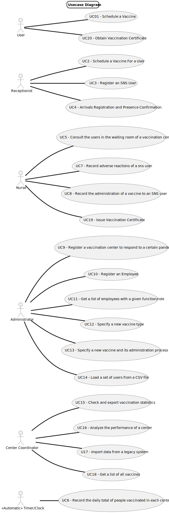

# Use Case Diagram (UCD)

**In the scope of this project, there is a direct relationship of _1 to 1_ between Use Cases (UC) and User Stories (US)
.**

However, be aware, this is a pedagogical simplification. On further projects and curricular units might also exist _1 to
N **and/or** N to 1 relationships between US and UC.

**For each UC/US, it must be provided evidences of applying main activities of the software development process (
requirements, analysis, design, tests and code). Gather those evidences on a separate file for each UC/US and set up a
link as suggested below.**

# Use Cases / User Stories

## User

| UC/US  | Description                                                                          |
|:-------|:-------------------------------------------------------------------------------------|
| US 001 | As an SNS user, I intend to use the application to schedule a vaccine.               |
| US 020 | As an SNS user, I intend to use the application to obtain a vaccination certificate. |

## Receptionist

| UC/US  | Description                                                                                                  |
|:-------|:-------------------------------------------------------------------------------------------------------------|
| US 002 | As a receptionist at one vaccination center, I want to schedule a vaccination for a User.                    |
| US 003 | As a receptionist, I want to register a SNS user.                                                            |
| US 004 | As a receptionist at a vaccination center, I want to register the arrival of a SNS user to take the vaccine. |

## Nurse

| UC/US  | Description                                                                            |
|:-------|:---------------------------------------------------------------------------------------|
| US 005 | As a nurse, I intend to consult the users in the waiting room of a vaccination center. |
| US 007 | As a nurse, I intend to record adverse reactions of a SNS user.                        |
| US 008 | As a nurse, I intend to record the administration of a vaccine to a SNS user.          |

## Administrator

| UC/US  | Description                                                                                    |                   
|:-------|:-----------------------------------------------------------------------------------------------|
| US 009 | As an Administrator, I want to register a vaccination center to respond to a certain pandemic. |
| US 010 | As an Administrator, I want to register an Employee.                                           |
| US 011 | As an Administrator, I want to get a list of employees with a given function/role.             |
| US 012 | As an Administrator, I intend to Specify a new vaccine type.                                   |
| US 013 | As an Administrator, I intend to specify a new vaccine and its administration process.         |
| US 014 | As an Administrator, I want to load a set of users from a CSV file.                            |

## Centre Coordinator

| UC/US  | Description                                                                                                      |                   
|:-------|:-----------------------------------------------------------------------------------------------------------------|
| US 015 | As a center coordinator, I intend to check and export vaccination statistics.                                    |
| US 016 | As a center coordinator, I intend to analyze the performance of a center.                                        |
| US 017 | As a center coordinator, I want to import data from a legacy system that was used in the past to manage centers. |
| US 018 | As a center coordinator, I want to get alist of all vaccines.                                                    |

## Timer

| UC/US  | Description                                                              |
|:-------|:-------------------------------------------------------------------------|
| US 006 | DGS want´s to record the daily total of people vaccinated in each center |