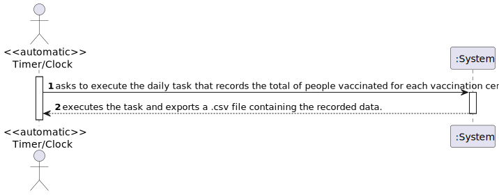
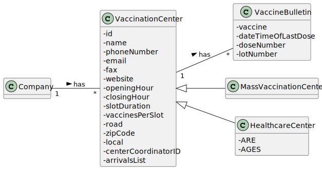
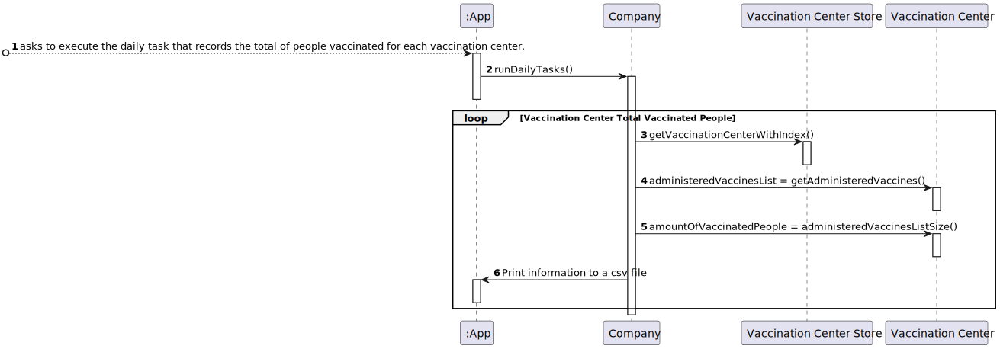
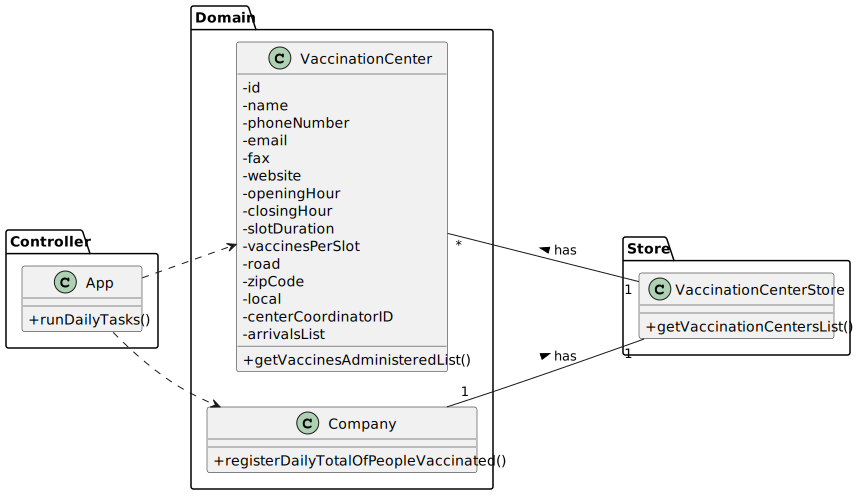

# US 006 - Record the daily total of vaccinated people in each vaccination center. 

## 1. Requirements Engineering

### 1.1. User Story Description

>* **_DGS wants to record daily the total number of people vaccinated in each vaccination center._**

### 1.2. Customer Specifications and Clarifications 

**From the specifications document:**

> * No relevant information regarding the specifications document.

**From the client clarifications:**

> **Question:** Dear client, In the acceptance criteria, "the algorithm should run automatically at a time defined in a configuration file and should register a date, the name of the vaccination center and the total number of vaccinated users." How is it supposed to register this information? Should it be recorded in a file (ex: txt,...) or recorded in the system (ex: in a store) ?
 
> **Answer:** The data should be written to a CSV file (field delimiter should be a semicolon).
 
> **Question:** We would like to know which kind of user (Administrator, Nurse...) is supposed to have access to the file generated by the system.
 
> **Answer:** Someone from DGS.
 
> **Question:** Is it supposed to have the possibility to change the information on the configuration file? If so, who can do it? 

> **Answer:** Yes. Please discuss this question with ESOFT teachers.

> **Question:** As per the acceptance criteria, can the job be deployed manually by a specific actor like Receptionist, Administrator,...? Who does the initial configuration for the automatic job?
 
> **Answer:** The algorithm should run automatically at a time defined in a configuration file and should register the date, the name of the vaccination center and the total number of vaccinated users.

> **Question:** After asking you to be more clear with your answer to my previous questions, you said that we can either access directly the "vaccinations report" file or create the option for center coordinators and administrators to view it's content, is this correct?
 
> **Answer:** You misunderstood, I didn't say that. The file should be available in the file system and anyone having access to the file system can read the file contents.
 
> **Question:** Do we need to create an UI for this US?
 
> **Answer:** No. Please study ESOFT!

> **Question:** Should the Company choose first the vaccination center that wants to analyze or should the program show the information of all the vaccination centers?
 
> **Answer:** Please read carefully the USs requirements and discuss them with your team. The application should show the information for all vaccination centers.

### 1.3. Acceptance Criteria

* **AC1:** The algorithm should run automatically at a time defined in a configuration file and should register the date, the name of the vaccination center and the total number of vaccinated users.

### 1.4. Found out Dependencies

>* There is a dependency found in US008 "As a nurse, I want to record the administration of a vaccine to a SNS user. At the end of the recovery period, the user should receive a SMS message informing the SNS user that he can leave the vaccination center.", because in order to get the daily number of vaccinated people, it's necessary that people get vaccinated.

### 1.5 Input and Output Data

**Input Data:**

>* There is no typed or selected data for the input.

**Output Data:**

>* A ".csv" file is created and the information about the daily total vaccinated people in each vaccinated center is exported to that file.

### 1.6. System Sequence Diagram (SSD)

### 1.7 Other Relevant Remarks

> *_There aren't any other relevant remarks._*

## 2. OO Analysis

### 2.1. Relevant Domain Model Excerpt 

### 2.2. Other Remarks

> *_There aren't any other relevant remarks._*

## 3. Design - User Story Realization 

### 3.1. Rationale

| *Interaction ID* | *Question: Which class is responsible for...* | *Answer*                | *Justification (with patterns)*                                                                                                                |
|:-----------------|:----------------------------------------------|:------------------------|:-----------------------------------------------------------------------------------------------------------------------------------------------|
| Step 1  		       | ...executing the scheduled task      	        | App                     | **Controller:** Intermediates the information between whats shown to the User and the domain.                                                  | 
| 		               | ...creating the csv file with the data	       | Company                 | **IE:** Has the necessary information to create the requested file.                                                                            | 
| 		               | ...supplying the list of vaccination centers  | VaccinationCentersStore | **IE:** Has the vaccination centers. Using a store promotes the **HCLC** principle, since this responsibility is not given to any other class. |
| 		               | ...supplying the list of vaccine bulletins    | VaccinationCenter       | **IE:** Knows it's own vaccine bulletins.                                                                                                      |

### Systematization ##

According to the taken rationale, the conceptual classes promoted to software classes are: 

* Company.
* VaccinationCenter.

Other software classes (i.e. Pure Fabrication) identified: 

* App.
* VaccinationCentersStore.

## 3.2. Sequence Diagram (SD)

## 3.3. Class Diagram (CD)

