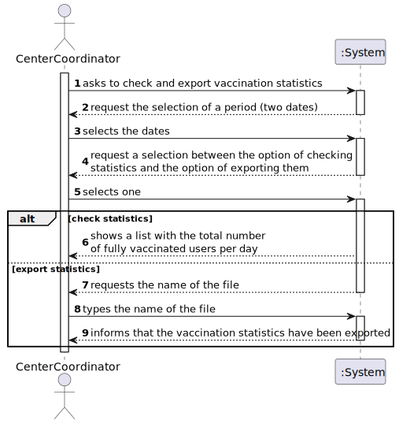
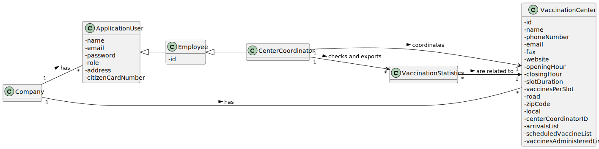
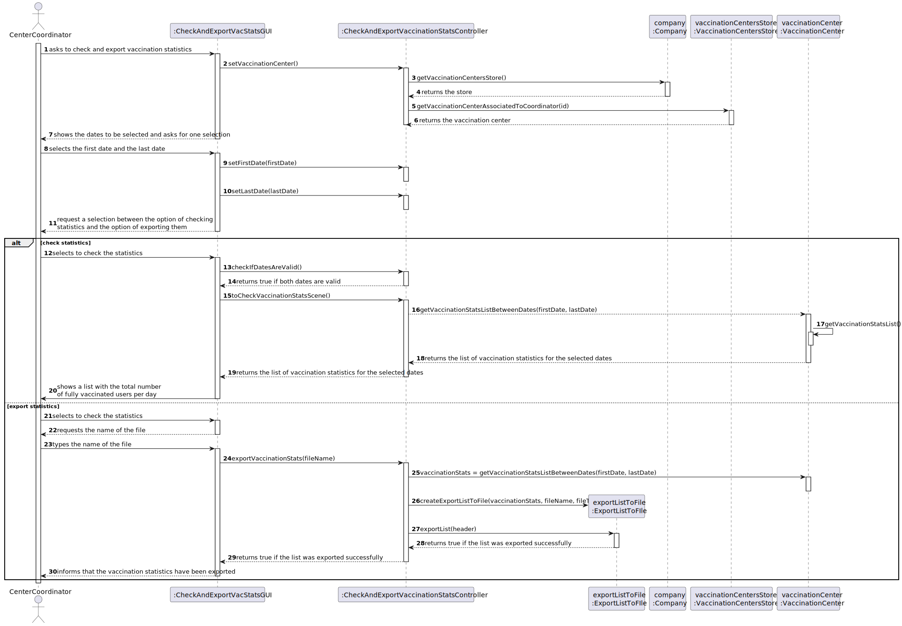

# US 015 - Check and export vaccination statistics

## 1. Requirements Engineering

### 1.1. User Story Description

As a **Center Coordinator**, I intend to **check** and **export** vaccination statistics. 
I want to export, to a csv file, the total number of fully vaccinated users per day.

### 1.2. Customer Specifications and Clarifications

### **From the specifications document:**

> Each vaccination center has a Center Coordinator that has the responsibility to manage the Covid19 vaccination process. The Center Coordinator wants to monitor the vaccination process, to see
statistics and charts, to evaluate the performance of the vaccination process, generate reports

### **From the client clarifications:**

**-From the requirements document:**
>The goal of this US is to explore this data jointly with data obtained from external sources to estimate the number of new cases and the number of deaths using information about the Reproduction Rate, Number of ICU Patients, Number of In-Hospital Patients, Number of New Cases, Positive Rate and Number of People Fully Vaccinated. In this study, simple linear and a multi-linear regression models should be developed to find the linear relationship between: 1- each independent variable and each dependent variable; 2- all six independent variables and each dependent variable; 3- three selected variables and each dependent variable. As the application is under development it is not possible to generate all data required for the analysis. Therefore, and to simulate a production system, we made available in moodle a file containing all the information required for this study. The regression analysis should be made outside the application and should be performed using Microsoft Excel spreadsheet program. The regression analysis should be documented in the application user manual (in the annexes) that must be delivered with the application. The report should include day and week (observed and estimated) values, the regression model used to estimate each value, R(SLR), R2 and R2 adjusted for SLR and MLR, confidence intervals and hypothesis tests for regression coefficients and significance model with Anova.

**-From the client forum:**

>**Questions:** 
> 
>1- When exporting vaccination statistics,do we export the data from all days available in the system or does the center coordinator chooses the time interval? 
>
>2-Is there any kind of format our exported data should follow?
> 
>**Answers:**
> 
>1- The user should define a time interval (two dates).
> 
>2- Data format: date; number of fully vaccinated user.

>**Question:**
>
>Is the exportation of the CSV file that contains the total number of fully vaccinated users per day, the only feature that needs to be implemented in code, for US15?
>
>**Answer:**
>
>Yes.

>**Questions:**
>
>1-Should the user introduce the name of the file intended to export the vaccination statistics ?
> 
> 2-Are the vaccination statistics referring only to the fully vaccinated users or referring to something more ?
>
>**Answer:**
>
>The user should introduce the name of the file.
> 
>Only to fully vaccinated users.

>**Question:**
>
>In this US should the Center Coordinator check and export the Vaccination Statistics of the Center where he/she works at or should just check and export the Vaccination Statistics of all centers?
>
>**Answer:**
>
>The center coordinator can only export statistics from the vaccination center that he coordinates.

### 1.3. Acceptance Criteria

* **AC1:** A file with the Vaccination Statistics is created.

### 1.4. Found out Dependencies

There is a dependency with US008, as it is required to have the necessary information that that US provides in order to create a file with the vaccination statistics.

### 1.5 Input and Output Data

**Input Data:**

* Typed data:
    - The name of the file intended to export the vaccination statistics.

* Selected data:
    - The time interval.
    - Between the options of checking or exporting the vaccination statistics.

**Output Data:**

  - The Vaccination Statistics;
  - A file with the Vaccination Statistics.

 

### 1.6. System Sequence Diagram (SSD)

### 1.7 Other Relevant Remarks

>No other relevant remarks.

## 2. OO Analysis

### 2.1. Relevant Domain Model Excerpt 

### 2.2. Other Remarks

> VaccinationStatistics represents the statistics of the vaccination process.
> By the VaccinationStatistics we get the total number of fully vaccinated users per day, in a center.
> The same center can have several statistics, as the Center Coordinator can check and export statistics for different time intervals.
> Per example: the Center Coordinator can check the statistics from day 1 to 10 of a month, and then export the statistics from day 10 to 20 of the next month. Therefore, those are different statistics.

## 3. Design - User Story Realization 

### 3.1. Rationale

| Interaction ID | Question: Which class is responsible for... | Answer  | Justification (with patterns)  |
|:-------------  |:--------------------- |:------------|:---------------------------- |
| Step 1         |    ...showing the dates and requesting the selection of a period (two dates) | CheckAndExportVacStatsGUI   |  **Pure Fabrication:** there is no reason to assign this responsibility to any existing class in the Domain Model. Using a Class for the interactions of the User with the System promotes the **HCLC** principle .  |
| |  ...saving the selected dates  | CheckAndExportVaccinationStatsController| **Controller:** act as a mediator between the UI and the Model. Has the responsibility of controlling the data transmission between both. **Pure Fabrication**: As there is no Domain Class with such responsibility one is following the Pure Fabrication pattern.      |
| Step 2         | ...requesting a selection between the option of checking statistics and the option of exporting them | CheckAndExportVacStatsGUI | **Pure Fabrication:** there is no reason to assign this responsibility to any existing class in the Domain Model. Using a Class for the interactions of the User with the System promotes the **HCLC** principle. |
| Step 3 (User chooses to check the Vaccination stats)| ... showing the list with the Center's Vaccination Statistics | CheckListVacStatsGUI |  **Pure Fabrication:** there is no reason to assign this responsibility to any existing class in the Domain Model.  |
| | ... disponibilize the previous list to the CheckListVacStatsGUI  | CheckAndExportVaccinationStatsController | **Controller:** act as a mediator between the UI and the Model. Has the responsibility of controlling the data transmission between both. **IE:** The controller knows the logged Center's Coordinator Center. |
| | ... "telling" the CheckAndExportVaccinationStatsController the logged Center's Coordinator Center | Company | **IE:** The Company knows the logged Center's Coordinator Center. |
| |    ... disponibilize the previous list to the CheckAndExportVaccinationStatsController  | VaccinationCenter | **IE:** The Vaccination Center knows it's own statistics, therefore by receiving the dates as an input he can return a filtered list.  |
| |    ... disponibilize the previous VaccinationCenter to the CheckAndExportVaccinationStatsController  | VaccinationCentersStore | **IE:** The VaccinationCentersStore knows all the Vaccination Centers of the Company.  |
| |    ... disponibilize the previous VaccinationCentersStore to the CheckAndExportVaccinationStatsController  | Company | **IE:** The Company knows all of its own stores, therefore it knows the Store related to the Vaccination Centers. The VaccinationCentersStore (and all the other stores) is created by **Pure Fabrication**, promoting the **HCLC** principle. |
| Step 3 (User chooses to export the Vaccination stats) | ... requesting the name of the file for the Vaccination Stats to be exported | CheckAndExportVacStatsGUI |  **Pure Fabrication:** there is no reason to assign this responsibility to any existing class in the Domain Model.  |
| Step 4 |  ... exporting the Vaccination Statistics | ExportListToFile | **Pure Fabrication:** there is no reason to assign this responsibility to any existing class in the Domain Model. By creating a Class to assign the responsibility of exporting a list we are adopting the **HCLC** principle as we are not assigning another responsibility to the Vaccination Center and we are promoting reusable code.  |
| 	 |    ... disponibilize the list with the statistics to ExportList | VaccinationCenter |**IE:** The Vaccination Center knows it's own statistics, therefore by receiving the dates as an input he can return a filtered list. |
| | ... sending the dates to the VaccinationCenter so the list can be filtered | CheckAndExportVaccinationStatsController | **IE:** The controller knows the two dates that the user selected previously.   |
| Step 5 |    ... informing the operation success | CheckAndExportVacStatsGUI |  **Pure Fabrication:** there is no reason to assign this responsibility to any existing class in the Domain Model.   |

### Systematization ##

According to the taken rationale, the conceptual classes promoted to software classes are:

* VaccinationCenter
* Company

Other software classes (i.e. Pure Fabrication) identified:
* CheckAndExportVacStatsGUI
* CheckAndExportVaccinationStatsController
* CheckListVacStatsGUI
* VaccinationCentersStore
* ExportListToFile

## 3.2. Sequence Diagram (SD)

## 3.3. Class Diagram (CD)

