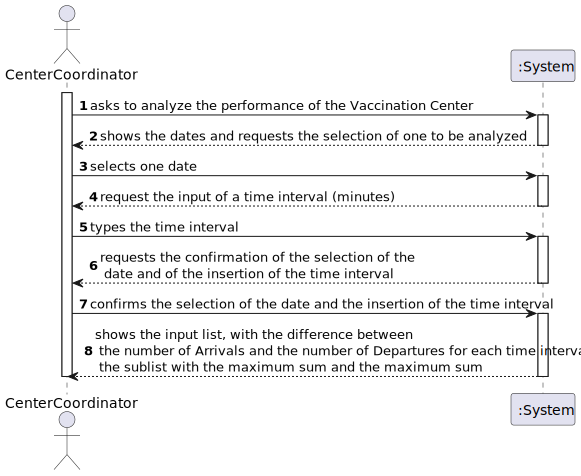
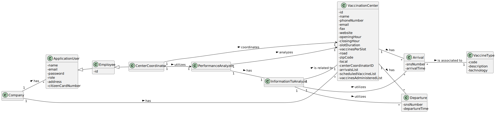
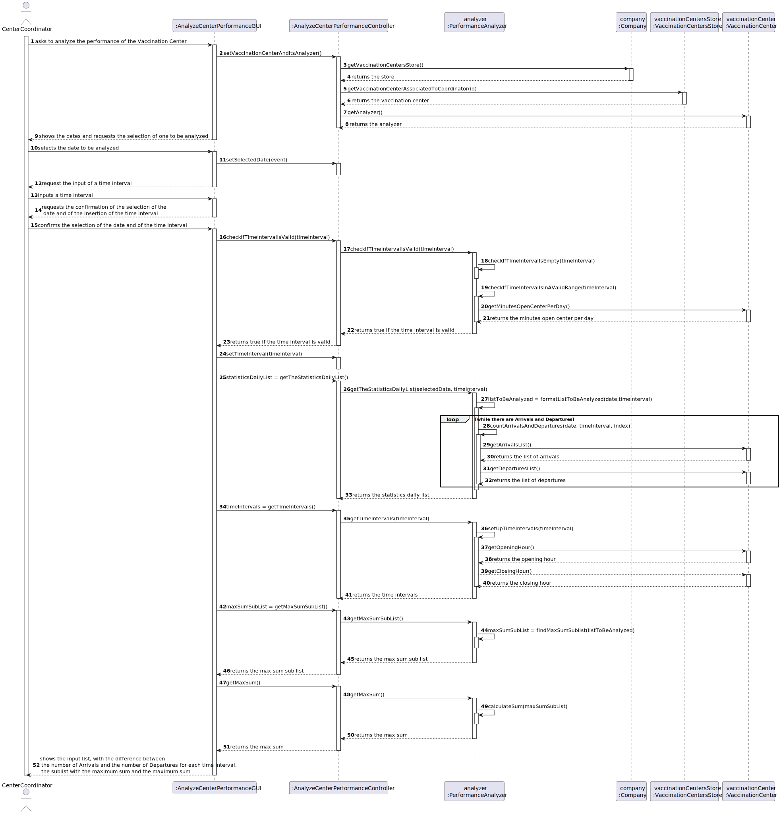
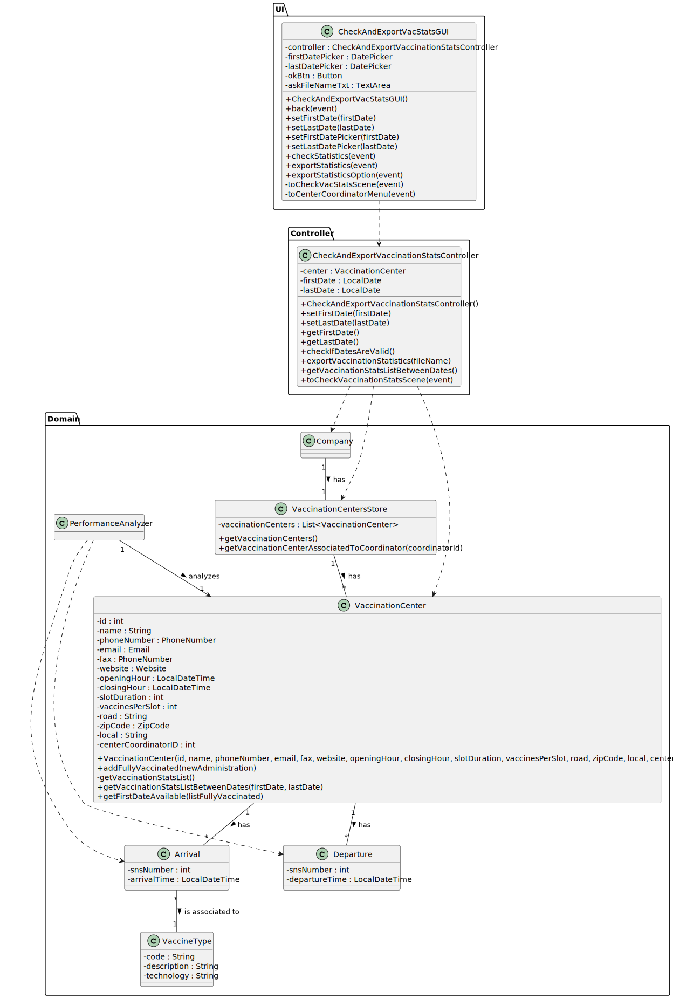

# US 016 - Analyze the performance of a center

## 1. Requirements Engineering

### 1.1. User Story Description

As a **Center Coordinator**, I intend to **analyze** the performance of a center.

### 1.2. Customer Specifications and Clarifications

### **From the specifications document:**

>The Center Coordinator wants to monitor the vaccination process, to see
statistics and charts, to evaluate the performance of the vaccination process, generate reports and
analyze data from other centers, including data from legacy systems. The goal of the performance
analysis is to decrease the number of clients in the center, from the moment they register at the
arrival, until the moment they receive the SMS informing they can leave the vaccination center. To
evaluate this, it proceeds as follows: for any time interval on one day, the difference between the
number of new clients arrival and the number of clients leaving the center every five-minute period
is computed.

>Now, the problem consists in determining what the contiguous subsequence of the initial sequence
is, whose sum of their entries is maximum. This will show the time interval, in such a day, when the
vaccination center was less effective in responding. So, the application should implement a brute-
force algorithm (an algorithm which examines all the contiguous subsequences) to determine the
contiguous subsequence with maximum sum. The implemented algorithm should be analyzed in
terms of its worst-case time complexity, and it should be compared to a benchmark algorithm
provided. The computational complexity analysis (of the brute-force algorithm and any sorting
algorithms implemented within this application), must be accompanied by the observation of the
execution time of the algorithms for inputs of variable size, in order to observe the asymptotic
behavior. The worst-case time complexity analysis of the algorithms should be properly
documented in the user manual of the application (in the annexes). The user manual must be
delivered with the application

### **From the client clarifications:**

**-From the requirements document:**
>The goal of this US is to implement a procedure that, for a specific day, and time intervals of m minutes (for m = 30, 20, 10, 5, and 1, for example) chosen by the coordinator of the center, with a daily work from 8 a.m. to 8 p.m., the procedure creates a list of length 720/m (respectively, lists of length 24, 36, 72, 144, 720), where the i-th value of the list is the difference between the number of new clients arriving and the number of clients leaving the center in that i-th time interval.
Then, the application should implement a brute-force algorithm (an algorithm which examines all the contiguous sublists of the input one) to determine the contiguous sublist with maximum sum. The output should be the input list, the maximum sum contiguous sublist and its sum, and the time interval corresponding to this contiguous sublist (for example, for time intervals of 1 hour, a list of length 12 is created; if, for example, the maximum sum contiguous sublist starts at the 2nd and ends at the 5th entries of the input list, with a sum s, it means that the vaccination center was less effective in responding from 9 a.m. to 1 p.m, with s clients inside the center).
The performance analysis should be documented in the application user manual (in the annexes) that must be delivered with the application. Also in the user manual, the implemented algorithm should be analyzed in terms of its worst-case time complexity. The complexity analysis must be accompanied by the observation of the execution time of the algorithms, and it should be compared to a benchmark algorithm provided, for inputs of variable size m, with m = 24, 36, 72, 144, 720, in order to observe the asymptotic behavior.

**-From the client forum:**

>**Question:**
>The file loaded in US17 have only one day to analyse, or it could have more than one day(?) and in US16 we need to select the day to analyse from 8:00 to 20:00
>
>**Answer:**
>The file can have data from more than one day. In US16 the center coordinator should select the day for which he wants to analyse the performance of the vaccination center.

>**Question:**
>Is the time of departure of an SNS user the time he got vaccinated plus the recovery time or do we have another way of knowing it?
>
**Answer:**
>The time of departure of an SNS user is the time he got vaccinated plus the recovery time

>**Questions:**
>In US 16, should the coordinator have the option to choose which algorithm to run (e.g. via a configuration file or while running the application) in order to determine the goal sublist, or is the Benchmark Algorithm strictly for drawing comparisons with the Bruteforce one?
>
**Answer:**
>The algorithm to run should be defined in a configuration file.
 

>**Question:**
>I would like to ask that if to analyse the performance of a center, we can assume (as a pre requirement) that the center coordinator was already attributed to a specific vaccination center and proceed with the US as so (like the center coordinator does not have to choose at a certain point where he is working. This is already treated before this US happens). Could you clarify this?
>
>**Answer:**
>A center coordinator can only coordinate one vaccination center. The center coordinator can only analyze the performance of the center that he coordinates.

>**Question**
>I would like to know if we could be strict the user to pick only those intervals (m) (i.e. 1, 5, 10, 20, 30) as options for analyzing the performance of a center, since picking intervals is dependent on the list which is 720/m (which the length is an integer result). If we let the user pick an interval that results in a non-integer result, this will result in an invalid list since some data for the performance analysis will be lost. Can you provide a clarification on this situation?
> 
> **Answer**
>  The user can introduce any interval value. The system should validate the interval value introduced by the user.

>**Question**
> From the Sprint D requirements it is possible to understand that we ought to implement a procedure that creates a list with the differences between the number of new clients arriving and the number of leaving clients for each time interval. My question then is, should this list strictly data from the legacy system (csv file from moodle which is loaded in US17), or should it also include data from our system?
> 
> **Answer**
>US 16 is for all the data that exists in the system.

### 1.3. Acceptance Criteria

* *AC1:* The output is the input list, the maximum sum contiguous sublist and its sum.

### 1.4. Found out Dependencies

There is a dependency with US008, as it is required to have the necessary information that that US provides in order to create a file with the vaccination statistics.
There is a dependency with both US004 and with US008, as to analyze this type of performance it is needed that a Vaccination center has both arrivals and departures.

### 1.5 Input and Output Data

*Input Data:*

* Typed data:
  - The name of the file intended to export the vaccination statistics.
  - The time interval

* Selected data:
  - The time interval.
  - Between the options of checking or exporting the vaccination statistics.
  - The date to analyze

*Output Data:*

 - The input list (with the differences of arrivals and departures for each time interval);
 - The Maximum Sum Sublist;
 - The Max Sum.

### 1.6. System Sequence Diagram (SSD)

### 1.7 Other Relevant Remarks

>No other relevant remarks.

## 2. OO Analysis

### 2.1. Relevant Domain Model Excerpt 

### 2.2. Other Remarks

>The Performance Analyzer is the tool that every Vaccination Center has available to help the Center Coordinator to analyze the performance of the center.
>The Information to analyze is a list with the difference of the number of new clients arriving and the number of clients leaving the center, at a given time interval.

## 3. Design - User Story Realization 

### 3.1. Rationale

| Interaction ID | Question: Which class is responsible for...                                                      | Answer                             | Justification (with patterns)                                                                                                                                                                                                                                                         |
|:---------------|:-------------------------------------------------------------------------------------------------|:-----------------------------------|:--------------------------------------------------------------------------------------------------------------------------------------------------------------------------------------------------------------------------------------------------------------------------------------|
| Step 1         | ...showing and requesting the selection of a date to be analyzed                                 | AnalyzeCenterPerformanceGUI        | **Pure Fabrication:** there is no reason to assign this responsibility to any existing class in the Domain Model. Using a Class for the interactions of the User with the System promotes the **HCLC** principle.                                                                     |
| Step 2         | ...requesting the input of a time interval                                                       | AnalyzeCenterPerformanceGUI        | **Pure Fabrication:** there is no reason to assign this responsibility to any existing class in the Domain Model. Using a Class for the interactions of the User with the System promotes the **HCLC** principle.                                                                     |
|                | ... checking if the inputted time interval is valid                                              | PerformanceAnalyzer                | **IE:** The PerformanceAnalyzer is responsible for analyzing the performance of a VaccinationCenter, therefore it knows what time intervals are valid for such operation.                                                                                                             |
|                | ... sending the inputted time interval to the PerformanceAnalyzer to be validated                | AnalyzeCenterPerformanceController | **Controller:** act as a mediator between the UI and the Model. Has the responsibility of controlling the data transmission between both, which contributes to the use of the **HCLC** principle, as we are not assigning this responsibility to any other Domain class.              |
|                | ... disponibilize the PerformanceAnalyzer to the AnalyzeCenterPerformanceController              | VaccinationCenter                  | **IE:** The VaccinationCenter knows its own PerformanceAnalyzer.                                                                                                                                                                                                                      |
|                | ... disponibilize the Arrivals and Departures of a given day to the PerformanceAnalyzer          | VaccinationCenter                  | **IE:** The VaccinationCenter knows its Arrivals and its Departures.                                                                                                                                                                                                                  |
|                | ... disponibilize the VaccinationCenter to the AnalyzeCenterPerformanceController                | VaccinationCentersStore            | **IE:** The VaccinationCentersStore knows all the Vaccination Centers of the Company.                                                                                                                                                                                                 |
|                | ... disponibilize the previous VaccinationCentersStore to the AnalyzeCenterPerformanceController | Company                            | **IE:** The Company knows all of its own stores, therefore it knows the Store related to the Vaccination Centers. The VaccinationCentersStore is created by **Pure Fabrication**, promoting the **HCLC**.                                                                             |
| Step 3         | ...requesting the confirmation of the selected date and the inserted time interval               | AnalyzeCenterPerformanceGUI        | **Pure Fabrication:** there is no reason to assign this responsibility to any existing class in the Domain Model. Using a Class for the interactions of the User with the System promotes the **HCLC** principle.                                                                     |
| Step 4         | ... showing the "input" list, the sublist with the maximum sum and the maximum sum               | AnalyzeCenterPerformanceGUI        | **Pure Fabrication:** there is no reason to assign this responsibility to any existing class in the Domain Model. Using a Class for the interactions of the User with the System promotes the **HCLC** principle.                                                                     |
|                | ... disponibilize the previous information to the AnalyzeCenterPerformanceGUI                    | AnalyzeCenterPerformanceController | **Controller:** act as a mediator between the UI and the Model. Has the responsibility of controlling the data transmission between both, which contributes to the use of the **HCLC** principle, as we are not assigning this responsibility to any other Domain class.              |
|                | ... disponibilize the previous information to the AnalyzeCenterPerformanceController             | PerformanceAnalyzer                | **IE:** The PerformanceAnalyzer of a center analyzes its performance, it has the results of such analysis. Using a different Class for the analysis of a Center performance, also follows the **HCLC** principle since we don't assign that responsibility to the Vaccination Center. |
|                | ... disponibilize the PerformanceAnalyzer to the AnalyzeCenterPerformanceController              | VaccinationCenter                  | **IE:** The VaccinationCenter knows its own PerformanceAnalyzer.                                                                                                                                                                                                                      |
|                | ... disponibilize the Arrivals and Departures of a given day to the PerformanceAnalyzer          | VaccinationCenter                  | **IE:** The VaccinationCenter knows its Arrivals and its Departures.                                                                                                                                                                                                                  |
|                | ... disponibilize the VaccinationCenter to the AnalyzeCenterPerformanceController                | VaccinationCentersStore            | **IE:** The VaccinationCentersStore knows all the Vaccination Centers of the Company.                                                                                                                                                                                                 |
|                | ... disponibilize the previous VaccinationCentersStore to the AnalyzeCenterPerformanceController | Company                            | **IE:** The Company knows all of its own stores, therefore it knows the Store related to the Vaccination Centers. The VaccinationCentersStore is created by **Pure Fabrication**, promoting the **HCLC**.                                                                             |

### Systematization ##

According to the taken rationale, the conceptual classes promoted to software classes are:

* VaccinationCenter
* Company
* Arrival
* Departure
* PerformanceAnalyzer

Other software classes (i.e. Pure Fabrication) identified:

* VaccinationCentersStore
* AnalyzeCenterPerformanceController
* AnalyzeCenterPerformanceGUI

## 3.2. Sequence Diagram (SD)

## 3.3. Class Diagram (CD)

