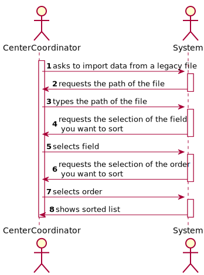
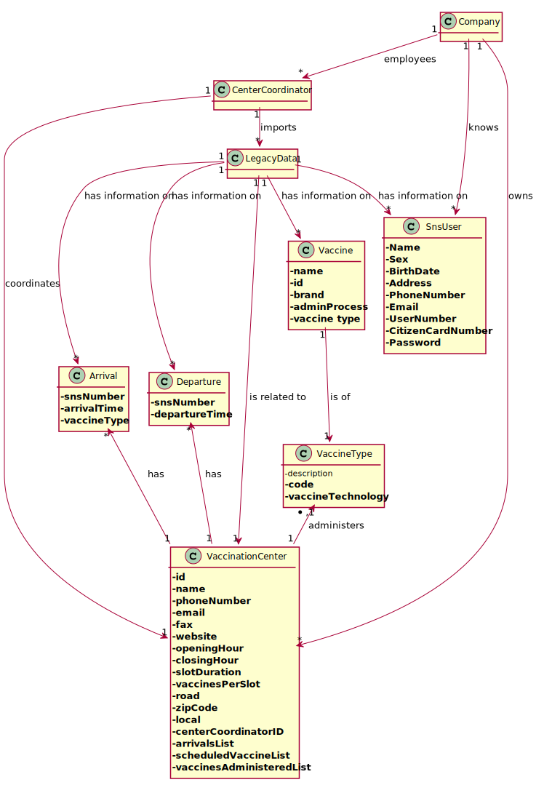
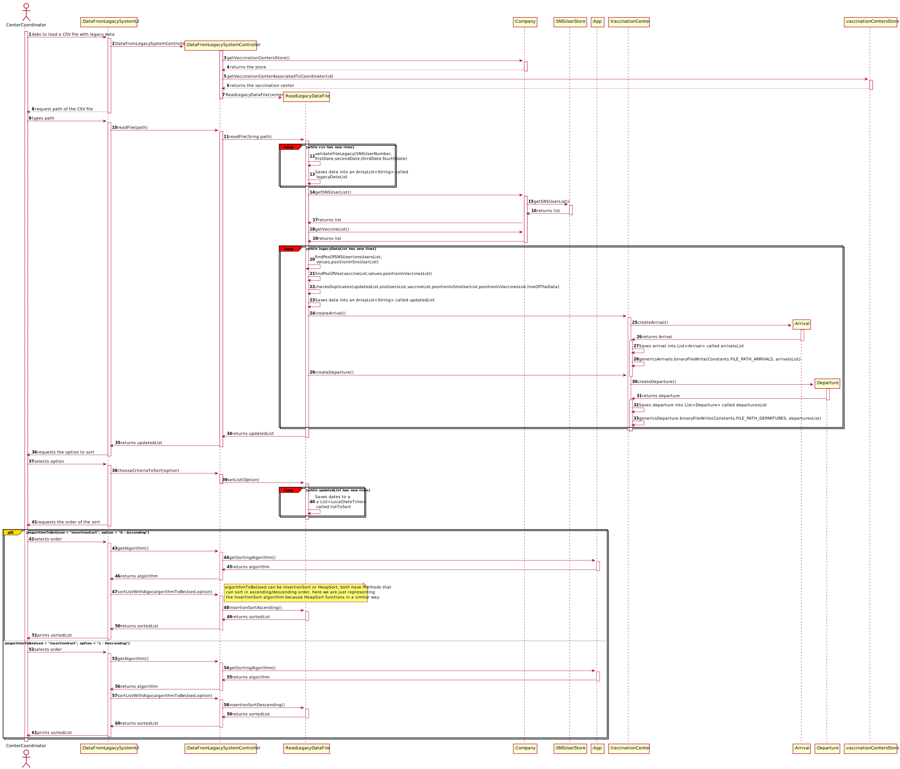
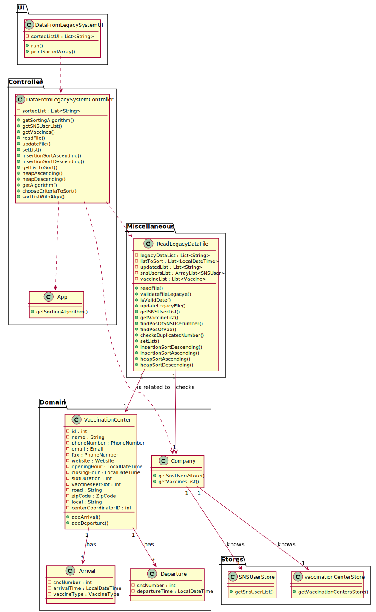

# US 017 - Import Data from a Legacy System

## 1. Requirements Engineering

### 1.1. User Story Description

As a **Center Coordinator**, I want to import data from a legacy system that was used in the past to manage centers.

### 1.2. Customer Specifications and Clarifications

**From the specifications document:**

> The Center Coordinator wants to monitor the vaccination process, to see
statistics and charts, to evaluate the performance of the vaccination process, generate reports and
analyze data from other centers, including data from legacy systems.

**From the client clarifications:**

>*Question:* "in a meeting you already clarified that when uploading a file from a legacy system the application should check if the SNS Users are already registered and if not US 014 should be put to use. My question is now if only one or two SNS Users are not registered, should the whole legacy file be discarded?".
>
>*Answer:* SNS users that are not registered should be loaded/registered. The other SNS users should not be registered again and should be ignored.

>*Question:* "The file loaded in US17 have only one day to analyse or it could have more than one day(?) and in US16 we need to select the day to analyse from 8:00 to 20:00"
>
>*Answer:* The file can have data from more than one day. In US16 the center coordinator should select the day for which he wants to analyse the performance of the vaccination center.

>*Question:* "Regarding the validation of the data in the performance data csv, in case the dose is the not the first one, should we check if the user age and the date when the user took the other vaccine dose, are valid for the new dose to be administered? (This question popped up whith the project description: "The vaccine administration process comprises (i) one or more age groups (e.g.: 5 to 12 years old, 13 to 18 years old, greater than 18 years old), and (ii) per age group, the doses to be administered (e.g.: 1, 2, 3), the vaccine dosage (e.g.: 30 ml), and the time interval regarding the previously administered dose. Regarding this, it is important to notice that between doses (e.g.: between the 1st and 2nd doses) the dosage to be administered might vary as well as the time interval elapsing between two consecutive doses (e.g.: between the 1st and 2nd doses 21 days might be required, while between the 2nd and the 3 rd doses 6 months might be required).")"
>
>*Answer:* The data from the legacy system (CSV file) should be validated before being loaded.
Even so, each team should create a Spikevax vaccine that allows loading all vaccinations from the example CSV file that is available in moodle. This is required for developing MDISC tasks and assessment.

>*Question:* "You already have clarified that when uploading a file from a legacy system the application should check if the SNS Users are already registered and if not, we should register them using US 014. How exactly do you want this to proceed, in case there aren't registered users, should the application ask the center coordinator to select the file with the users data to be uploaded?"
>
>*Answer:*  US14 and US17 are two different features of the system. In US17, if the SNS user does not exist in the system, the vaccination of this SNS user should not be loaded. The system should continue processing the CSV file until all vaccinations are processed.

>*Question:* The file loaded in US17 have only one day to analyse or it could have more than one day(?) and in US16 we need to select the day to analyse from 8:00 to 20:00
>
>*Answer:* The file can have data from more than one day. In US16 the center coordinator should select the day for which he wants to analyse the performance of the vaccination center.

>*Question:* "Should the configuration file be defined , manually, before strating the program? Or Should an administrator or another DGS entity be able to alter the file in a user interface? This question is also important for US06 and US16 since these US also use configuration files, will the same process be applied to them?"
>
>*Answer:* The configuration file should be edited manually.

>*Question:* 1 - When sorting data by arrival time or central leaving time, should we sort from greater to smallest or from smallest to greater? 2 - Also, should we consider only time or date also? So, for example, if we sort from smaller to greater and consider a date also, 20/11/2020 11:00 would go before 20/12/2020 08:00. Without considering the date (only time) it would be 20/12/2020 08:00 before 20/11/2020 11:00.
>
>*Answer:* 1. The user must be able to sort in ascending and descending order. 2. Date and time should be used to sort the data. Sort the data by date and then by time.

>*Question:* "Should the vaccine named Spikevax, (the one in the given CSV file for US17), be registered before loading the CSV file?"
>
>*Answer:* Yes.

>*Question:* "You already have clarified that when uploading a file from a legacy system the application should check if the SNS Users are already registered and if not, we should register them using US 014. How exactly do you want this to proceed, in case there aren't registered users, should the application ask the center coordinator to select the file with the users data to be uploaded?"
>
>*Answer:* US14 and US17 are two different features of the system. In US17, if the SNS user does not exist in the system, the vaccination of this SNS user should not be loaded. The system should continue processing the CSV file until all vaccinations are processed.

>*Question:*  "In the Sprint D requirements is stated that two sorting algorithms should be implemented and that the imported data should be sorted by arrival time or center leaving time. Should each algorithm be capable of both sortings or is one of the algorithms supposed to do one (e.g. arrival time) and the other the remaining sorting criteria (e.g. leaving time)?"
>
>*Answer:* Each algorithm should be capable of doing both sortings. The application should be prepared to run both algorithms. The algorithm that will be used to sort data should be defined in a configuration file.

### 1.3. Acceptance Criteria

* **AC01:** Two sorting algorithms should be implemented
* **AC02:** The center coordinator must be able to choose the file that is to be uploaded
* **AC03:** Only files with valid information are accepted by the system.
* **AC04:** Duplicated information is ignored by the system.
* **AC05:** Lines that have valid information but if either the SNS user number or the vaccine name aren't registered in the system will be ignored.
* **AC06:** The list should be presented to the Coordinator sorted by arrival/leave time.
* **AC07:** The name/vaccine description attributes should be presented to the Coordinator.

### 1.4. Found out Dependencies

US017 has dependencies with US010 because it needs a Center Coordinator registered in order to access the sorting function.

US017 has dependencies with US014/03 because it needs to compare the SNS User number in the file to the ones registered in the system and then get the name linked to that number.

US017 has dependencies with US013 because it needs to compare the vaccine name in the file to the ones registered in the system.

US017 has dependencies with US012 because it needs to compare the vaccine name registered in the system to its vaccine type short description.

### 1.5 Input and Output Data

**Input Data:**

* Typed data:
    - File Path
* Selected data:
    - Option of the sort
    - Order of the sort

**Output Data:**

* Warning about the file validity
* Warning that the information from the list isn't registered in the system
* A sorted list
* (In)Success of the operation

### 1.6. System Sequence Diagram (SSD)

### 1.7 Other Relevant Remarks

* N/A

## 2. OO Analysis

### 2.1. Relevant Domain Model Excerpt

### 2.2. Other Remarks

No remarks.

## 3. Design - User Story Realization

### 3.1. Rationale

| Interaction ID | Question: Which class is responsible for... | Answer  | Justification (with patterns)  |
|:-------------  |:--------------------- |:------------|:---------------------------- |
| Step 1  | Asking to load a CSV file with legacy data?	                                                                    |  DataFromLegacySystemUI                 | **Pure Fabrication:** there is no reason to assign this responsibility to any existing class in the Domain Model. Using a Class for the interactions of the User with the System promotes the **HCLC** principle.                            |
| 		  |  ... getting the vaccines list from the Store                                                                   |  Company                                | **IE:** The company knows all the stores.                                                                                                                                                                                                    |
| 		  |  ... getting the Vaccination Center associated with the Coordinator                                             |  vaccinationCenterStore                 | **IE:** Has info on all the vaccination centers. Using a store promotes the **HCLC** principle, since this responsibility is not given to any other class.                                                                                               |
| Step 2  |	Requesting the path of the CSV File?	                                                                        |  DataFromLegacySystemUI                 | **Pure Fabrication:** there is no reason to assign this responsibility to any existing class in the Domain Model. Using a Class for the interactions of the User with the System promotes the **HCLC** principle.                            |
| Step 3  |	Typing the path of the CSV File?	                                                                            |  DataFromLegacySystemUI                 | **Pure Fabrication:** there is no reason to assign this responsibility to any existing class in the Domain Model. Using a Class for the interactions of the User with the System promotes the **HCLC** principle.                            |
| 		  |  ... transferring path from the UI to the ReadLegacyDataFile                                                    |  DataFromLegacySystemController         | **Controller:** act as a mediator between the UI and the Model, in this case the ReadLegacyDataFile class. Has the responsibility of controlling the data transmission between both.                                                         |
| 		  |  ... validating the lines of the file?                                                                          |  ReadLegacyDataFile                     | **IE:** The ReadLegacyDataFile knows the file, so it can validate all it's lines.                                                                                                                                                            |
| 		  |  ... saving the data into an ArrayList?                                                                         |  ReadLegacyDataFile                     | **IE:** The ReadLegacyDataFile knows the file so it can save that data on an ArrayList.                                                                                                                                                      |
| 		  |  ... getting the list of SNS users from the Store                                                               |  Company                                | **IE:** The company knows all the stores.                                                                                                                                                                                                    |
| 		  |  ... getting the list with all SNS users                                                                        |  SNSUserStore                           | **IE:** The SNSUserStore knows all sns users. Using a store promotes the **HCLC** principle, since this responsibility is not given to any other class.                                                                                                                                                                                                  |
| 		  |  ... getting the list with all vaccines                                                                         |  Company                                | **IE:** The company knows all vaccines registered in the system.                                                                                                                                                                             |
| 		  |  ... finding the position of the SNS User in the list that has the same SNS User number from the file	        |  ReadLegacyDataFile                     | **IE:** Now that the list with all SNS users was transferred to the ReadLegacyDataFile class, it knows all SNS users registered in the system and all the SNS users numbers saved to the ArrayList, therefore it can make such comparisons.  |
| 		  |  ... finding the position of the vaccine name in the list that has the same vaccine name from the file	        |  ReadLegacyDataFile                     | **IE:** Now that the list with all vaccines was transferred to the ReadLegacyDataFile class, it knows all vaccines registered in the system and all the vaccines saved to the ArrayList, therefore it can make such comparisons.             |
| 		  |  ... checking for duplicates	                                                                                |  ReadLegacyDataFile                     | **IE:** The ReadLegacyDataFile knows the ArrayList, so it can check inside it for duplicates.                                                                                                                                                |                                                              
| 		  |  ... saving that data into a new ArrayList that will be used by the sorting algorithm	                        |  ReadLegacyDataFile                     | **IE:** The ReadLegacyDataFile knows the ArrayList, so it can save that data into a new ArrayList.                                                                                                                                               |
| 		  |  ... creating an Arrival	                                                                                    |  Company                                | By applying the **Creator** pattern, the "Company" is responsible for instantiating a new "Arrival", since it is the one who has the information to do so.                                                                                                                                               |
| 		  |  ... saving that Arrival into a list of arrivals	                                                            |  VaccinationCenter                      | **IE:** The vaccination center knows all it's arrivals.                                                                                                                                                |
| 		  |  ... serializing the arrival	                                                                                |  VaccinationCenter                      | **IE:** The Vaccination Center knows all the needed info the serialize the arrival.                                                                                                                                                |
| 		  |  ... creating an Departure	                                                                                    |  Company                                |  By applying the **Creator** pattern, the "Company" is responsible for instantiating a new "Departure", since it is the one who has the information to do so.                                                                                                                                                |
| 		  |  ... saving that Departure into a list of departures	                                                        |  VaccinationCenter                      | **IE:** The vaccination center knows all it's departures                                                                                                                                              |
| 		  |  ... serializing the departure	                                                                                |  VaccinationCenter                      | **IE:** The Vaccination Center knows all the needed info the serialize the departure.                                                                                                                                                 |
| 		  |  ... returning the list from the ReadLegacyDataFile to the UI                                                   |  DataFromLegacySystemController         | **Controller:** act as a mediator between the UI and the Model. Has the responsibility of controlling the data transmission between both.                                                                                                    |                                                                                                                                     
| Step 4  |	Showing the fields to sort                                                                                      |  DataFromLegacySystemUI                 | **Pure Fabrication:** there is no reason to assign this responsibility to any existing class in the Domain Model. Using a Class for the interactions of the User with the System promotes the **HCLC** principle.                            | 
| Step 5  |	Selecting one of the fields				                                                                        |  DataFromLegacySystemUI                 | **Pure Fabrication:** there is no reason to assign this responsibility to any existing class in the Domain Model. Using a Class for the interactions of the User with the System promotes the **HCLC** principle.                            |
| 		  |  ... transferring the field option from the UI to the ReadLegacyDataFile                                        |  DataFromLegacySystemController         | **Controller:** act as a mediator between the UI and the Model. Has the responsibility of controlling the data transmission between both.                                                                                                    |
| 		  |  ... saving the list of all the dates from the field option that was chosen                                     |  ReadLegacyDataFile                     | **HC-LC:** The ReadLegacyDataFile is the class responsible to deal with all data that must be saved.                                                                                                                                         | 
| Step 6  |	Showing the orders to sort				                                                                        |  DataFromLegacySystemUI                 | **Pure Fabrication:** there is no reason to assign this responsibility to any existing class in the Domain Model. Using a Class for the interactions of the User with the System promotes the **HCLC** principle.                            | 
| Step 7  |	Selecting one of the orders				                                                                        |  DataFromLegacySystemUI                 | **Pure Fabrication:** there is no reason to assign this responsibility to any existing class in the Domain Model. Using a Class for the interactions of the User with the System promotes the **HCLC** principle.                            |
| 		  |  ... getting the sorting algorithm from the config file to the controller                                       |  App                                    | **IE:** The App knows the sorting algorithm.                                                                                                                                                                                                 |
| 		  |  ... getting the sorting algorithm to the UI                                                                    |  DataFromLegacySystemController         | **Controller:** act as a mediator between the UI and the Model. Has the responsibility of controlling the data transmission between both.                                                                                                    |                                                                                                                                        
| 		  |  ... transferring the sorting algorithm and the order option to the ReadLegacyDataFile                          |  DataFromLegacySystemController         | **Controller:** act as a mediator between the UI and the Model. Has the responsibility of controlling the data transmission between both.                                                                                                    |                                                                                                                                  
| 		  |  ... sorting the list                                                                                           |  ReadLegacyDataFile                     | **IE:** The ReadLegacyDataFile knows both the list to be sorted and the updated list.                                                                                                                                                        |                                 
| 		  |  ... getting the sorted list to the UI                                                                          |  DataFromLegacySystemController         | **Controller:** act as a mediator between the UI and the Model. Has the responsibility of controlling the data transmission between both.                                                                                                    |                                                                                                                                  
| Step 8  | Printing the sorted list                                                                                        |  DataFromLegacySystemUI                 | **Pure Fabrication:** there is no reason to assign this responsibility to any existing class in the Domain Model. Using a Class for the interactions of the User with the System promotes the **HCLC** principle.                            |

### Systematization ##

According to the taken rationale, the conceptual classes promoted to software classes are:

* ReadLegacyDataFile
* Company
* VaccinationCenter

Other software classes (i.e. Pure Fabrication) identified:

* DataFromLegacySystemUI
* vaccinationCenterStore
* SNSUserStore
* App
* DataFromLegacySystemController

## 3.2. Sequence Diagram (SD)

## 3.3. Class Diagram (CD)

